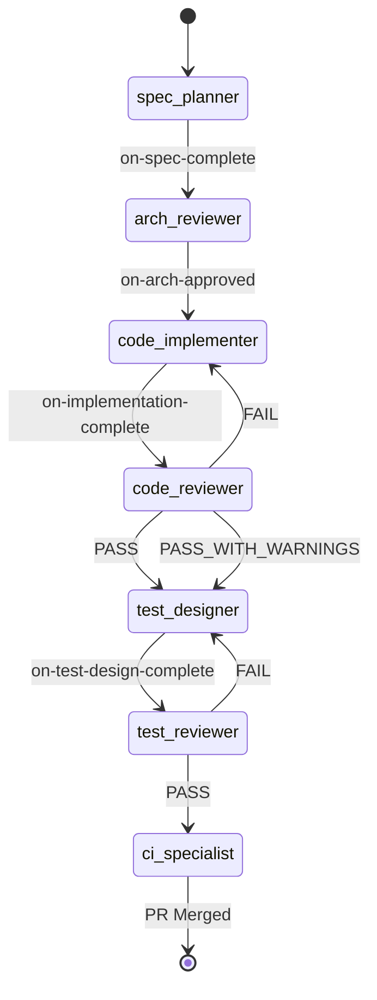
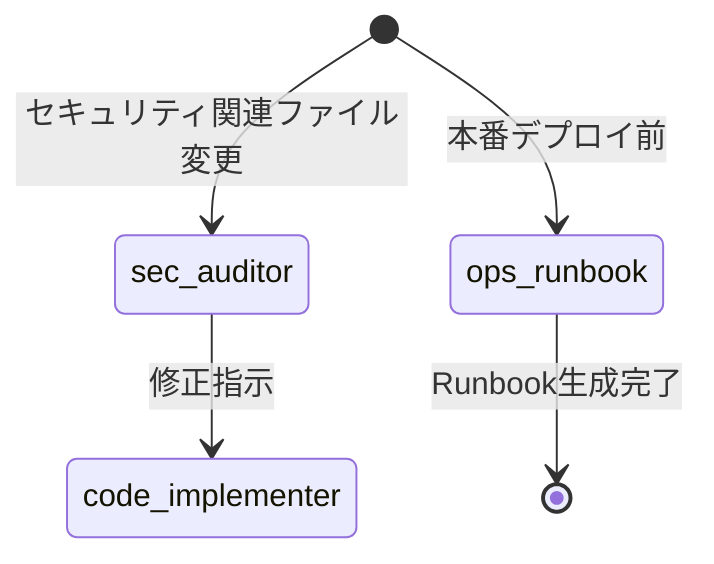

# SubAgent統合アーキテクチャ設計書

**プロジェクト**: Mirai Knowledge Systems
**バージョン**: 1.0.0
**作成日**: 2026-02-06
**対象フェーズ**: Phase D-6（将来実装）
**設計者**: architecture-designer (SubAgent)

---

## 📋 目次

1. [概要](#概要)
2. [アーキテクチャ原則](#アーキテクチャ原則)
3. [SubAgent構成](#subagent構成)
4. [工程遷移フロー](#工程遷移フロー)
5. [Hooks統合仕様](#hooks統合仕様)
6. [自動レビューゲート](#自動レビューゲート)
7. [自動並列実行トリガー](#自動並列実行トリガー)
8. [MCP統合戦略](#mcp統合戦略)
9. [ファイルアクセス制御](#ファイルアクセス制御)
10. [エラー処理・暴走防止](#エラー処理暴走防止)
11. [監視・可観測性](#監視可観測性)
12. [実装ロードマップ](#実装ロードマップ)

---

## 1. 概要

### 1.1 目的

本アーキテクチャは、**9体のSubAgent + Hooks + MCP統合**により、以下を実現する：

- **自動化された品質ゲート**: 仕様→設計→実装→テスト→リリースの工程遷移を自動制御
- **並列実行による生産性向上**: 独立タスクの並列処理、複雑な調査タスクの並行化
- **ITSM準拠の証跡管理**: 全工程の意思決定・変更履歴の記録
- **セキュリティ・品質の自動保証**: 自動レビューゲート、脆弱性スキャン、テスト網羅性検証

### 1.2 適用範囲

- **Phase D-6以降**: SubAgent統合基盤の実装
- **すべての新機能開発**: 工程遷移Hooksの適用
- **すべてのセキュリティ関連変更**: sec-auditorの自動起動
- **本番デプロイ前**: ops-runbookの自動生成

### 1.3 前提条件

- Claude Code CLI v1.0以降
- MCP Servers: memory, memory-keeper, github, chrome-devtools, sequential-thinking, brave-search, context7
- Git repository: 変更管理とPR自動作成
- 既存のCI/CD: GitHub Actions（self-hosted runner）

---

## 2. アーキテクチャ原則

### 2.1 設計原則

| 原則 | 説明 | 根拠 |
|------|------|------|
| **工程スキップ禁止** | Hooksを経由しない遷移は禁止 | 品質ゲートの実効性確保 |
| **レビューFAIL時の差し戻し** | 自動的に前工程に戻す | 品質担保・証跡記録 |
| **仕様外実装禁止** | 設計書に記載のない機能は未実装扱い | スコープクリープ防止 |
| **並列開発のファイル排他制御** | 同一ファイルへの同時書き込み禁止 | コンフリクト防止 |
| **MCP初動確認** | memory/memory-keeperで過去決定を必ず確認 | 設計の一貫性確保 |

### 2.2 責務分離

| レイヤー | 責務 | 担当SubAgent |
|---------|------|--------------|
| **要件定義** | ビジネス要件→技術仕様への変換 | spec-planner |
| **設計レビュー** | アーキテクチャ妥当性検証 | arch-reviewer |
| **実装** | コード生成（設計準拠） | code-implementer |
| **コードレビュー** | 自動レビューゲート（機械判定） | code-reviewer |
| **テスト設計** | 正常/異常/境界/権限のテストケース設計 | test-designer |
| **テストレビュー** | テスト網羅性検証 | test-reviewer |
| **CI/リリース** | GO/NO-GO判定、PR作成・マージ | ci-specialist |
| **セキュリティ監査** | 脆弱性スキャン、CVEチェック | sec-auditor |
| **運用手順書** | Runbook生成、障害対応手順 | ops-runbook |

---

## 3. SubAgent構成

### 3.1 コアSubAgent（7体）- 必須工程

#### 3.1.1 spec-planner

**責務**: 要件・運用定義（ITSM/ISO準拠）

**入力**:
- ユーザー要求（自然言語）
- 既存仕様（memory-keeper）

**出力**:
```
specs/
├── SPEC_{FEATURE_NAME}.md
│   ├── 1. ビジネス要件
│   ├── 2. 機能要件
│   ├── 3. 非機能要件（性能、セキュリティ、可用性）
│   ├── 4. 運用要件（監視、バックアップ、障害対応）
│   └── 5. 受け入れ基準
└── SPEC_{FEATURE_NAME}_CHANGELOG.md
```

**使用MCP**:
- `memory-keeper`: 過去の要件定義の検索
- `github`: 類似機能のIssue検索

**成果物チェックリスト**:
- [ ] 機能要件が測定可能
- [ ] 非機能要件にSLA/SLO明記
- [ ] 運用要件に障害検知・復旧手順記載
- [ ] 受け入れ基準が明確

---

#### 3.1.2 arch-reviewer

**責務**: 設計レビュー（アーキテクチャ妥当性検証）

**入力**:
- `specs/*.md`（spec-plannerの成果物）

**出力**:
```
design/
├── DESIGN_{FEATURE_NAME}.md
│   ├── 1. アーキテクチャ概要（レイヤー図）
│   ├── 2. コンポーネント設計
│   ├── 3. データフロー図
│   ├── 4. API設計
│   ├── 5. エラー処理戦略
│   ├── 6. セキュリティ設計
│   └── 7. パフォーマンス考慮事項
└── reviews/ARCH_REVIEW_{FEATURE_NAME}.json
    └── { "result": "PASS|FAIL", "issues": [...] }
```

**使用MCP**:
- `sequential-thinking`: 複雑な設計判断
- `context7`: フレームワーク仕様確認
- `github`: 類似実装の検索

**判定基準**:
```json
{
  "pass_criteria": {
    "layering": "レイヤー分離が明確",
    "error_handling": "例外処理戦略が定義済み",
    "security": "認証・認可・監査ログ設計済み",
    "performance": "スケーラビリティ考慮",
    "maintainability": "ハードコード排除、設定外出し"
  }
}
```

---

#### 3.1.3 code-implementer

**責務**: 実装（設計準拠・仕様外禁止）

**入力**:
- `design/*.md`（arch-reviewerの成果物）

**出力**:
```
src/**, backend/**, webui/**
（設計書に記載された実装のみ）
```

**制約**:
- **設計書に記載のない機能は実装しない**
- **ファイル排他制御**: 並列実行時は別ファイルツリーのみ担当
- **証跡記録**: 実装理由をコミットメッセージに記載

**使用MCP**:
- `context7`: ライブラリAPI確認
- `memory-keeper`: 実装パターンの参照

---

#### 3.1.4 code-reviewer

**責務**: 自動レビューゲート（機械判定）

**入力**:
- 変更ファイル（code-implementerの成果物）
- `specs/*.md`
- `design/*.md`

**出力**:
```json
{
  "result": "PASS | FAIL | PASS_WITH_WARNINGS",
  "summary": "総評",
  "blocking_issues": [
    {
      "file": "backend/app_v2.py",
      "line": 120,
      "issue": "例外処理なし",
      "severity": "BLOCKER"
    }
  ],
  "warnings": [
    {
      "file": "webui/app.js",
      "line": 45,
      "issue": "console.log残留",
      "severity": "MINOR"
    }
  ],
  "recommended_fixes": [
    "backend/app_v2.py:120に try/except 追加",
    "webui/app.js:45のconsole.logをLogger.debug()に置換"
  ]
}
```

**判定基準**: [4. 自動レビューゲート](#4-自動レビューゲート)参照

---

#### 3.1.5 test-designer

**責務**: テスト設計（正常/異常/境界/権限のテストケース設計）

**入力**:
- `specs/*.md`
- `design/*.md`
- 実装ファイル（code-implementerの成果物）

**出力**:
```
tests/
├── TEST_PLAN_{FEATURE_NAME}.md
│   ├── 1. テスト戦略
│   ├── 2. テストケース
│   │   ├── 正常系（Happy Path）
│   │   ├── 異常系（エラーハンドリング）
│   │   ├── 境界値（Edge Cases）
│   │   └── 権限テスト（RBAC）
│   └── 3. 受け入れ基準
└── unit/, integration/, e2e/
    └── test_{feature_name}.py / .spec.js
```

**カバレッジ目標**:
- **ユニットテスト**: 90%以上
- **統合テスト**: 主要フロー100%
- **E2Eテスト**: Critical Path 100%

---

#### 3.1.6 test-reviewer

**責務**: テストレビュー（網羅性チェック）

**入力**:
- `tests/TEST_PLAN_*.md`（test-designerの成果物）

**出力**:
```json
{
  "result": "PASS | FAIL",
  "coverage_analysis": {
    "normal_cases": { "covered": 10, "total": 10 },
    "error_cases": { "covered": 8, "total": 10 },
    "edge_cases": { "covered": 5, "total": 5 },
    "permission_tests": { "covered": 4, "total": 4 }
  },
  "missing_tests": [
    "異常系: DB接続エラー時の挙動",
    "異常系: タイムアウト時のリトライ"
  ]
}
```

**判定基準**:
- 正常系カバレッジ: 100%
- 異常系カバレッジ: 80%以上
- 境界値テスト: 必須
- 権限テスト: RBACが関係する場合は必須

---

#### 3.1.7 ci-specialist

**責務**: CI/リリース（GO/NO-GO判定、PR作成・マージ）

**入力**:
- テスト結果（test-reviewerの成果物）
- CIビルドログ

**出力**:
```
ci/**
.github/workflows/**
+ PR作成・マージ実行
```

**判定基準**:
```yaml
go_criteria:
  - test_pass_rate: 100%
  - test_coverage: ≥90%
  - no_blocker_issues: true
  - security_scan: PASS
```

**使用MCP**:
- `github`: PR作成・マージ

---

### 3.2 補助SubAgent（2体）- 特殊工程

#### 3.2.1 sec-auditor

**責務**: セキュリティ監査（脆弱性スキャン、CVEチェック）

**起動条件**:
- セキュリティ関連ファイル変更検知
  - `backend/auth/**`
  - `backend/csrf_protection.py`
  - `backend/password_policy.py`
  - `webui/auth-guard.js`

**出力**:
```
security/
├── SECURITY_AUDIT_{DATE}.md
│   ├── 1. 脆弱性スキャン結果
│   ├── 2. CVE照合結果
│   ├── 3. OWASP Top 10チェック
│   └── 4. 推奨対策
└── audits/AUDIT_{FEATURE_NAME}.json
```

**使用MCP**:
- `brave-search`: CVE情報検索
- `github`: セキュリティアドバイザリ確認

---

#### 3.2.2 ops-runbook

**責務**: 運用手順書作成（Runbook生成、障害対応手順）

**起動条件**:
- 本番デプロイ前（Phase C-1〜C-4）
- 新規インフラコンポーネント追加時

**出力**:
```
runbook/
├── RUNBOOK_{FEATURE_NAME}.md
│   ├── 1. 起動・停止手順
│   ├── 2. ヘルスチェック
│   ├── 3. 障害検知・通知
│   ├── 4. 障害復旧手順
│   └── 5. ロールバック手順
└── docs/operations/
    └── OPS_GUIDE_{FEATURE_NAME}.md
```

**使用MCP**:
- `memory-keeper`: 過去の障害事例検索

---

## 4. 工程遷移フロー

### 4.1 基本フロー



### 4.2 補助SubAgentのトリガー



---

## 5. Hooks統合仕様

### 5.1 Hook一覧

| Hook名 | トリガー条件 | 実行内容 |
|--------|------------|----------|
| **on-spec-complete** | spec-plannerが`specs/*.md`を出力 | arch-reviewerを自動起動 |
| **on-arch-approved** | arch-reviewerが`PASS`を返却 | code-implementerを起動 |
| **on-implementation-complete** | code-implementerが「実装完了」宣言 | code-reviewerを起動 |
| **on-code-review-result** | code-reviewerが判定完了 | 後続処理を分岐 |
| **on-test-design-complete** | test-designerが`tests/*.md`を出力 | test-reviewerを起動 |
| **on-test-review-result** | test-reviewerが判定完了 | ci-specialistを起動 |

### 5.2 Hook実装例（on-code-review-result）

```python
# .claude/hooks/on-code-review-result.py
import json
import sys

def main():
    result_file = sys.argv[1]
    with open(result_file, 'r') as f:
        result = json.load(f)

    if result['result'] == 'FAIL':
        # code-implementerに差し戻し
        print(f"HOOK: 差し戻し → code-implementer")
        print(f"理由: {result['blocking_issues']}")
        # SubAgent起動コマンド生成
        return {
            "action": "start_subagent",
            "agent": "code-implementer",
            "input": {
                "review_result": result,
                "mode": "fix"
            }
        }
    elif result['result'] == 'PASS_WITH_WARNINGS':
        # ユーザーに通知
        print(f"HOOK: PASS（警告あり） → ユーザー通知")
        print(f"警告: {result['warnings']}")
        # test-designer起動可
        return {
            "action": "notify_user",
            "message": "コードレビュー合格（警告あり）",
            "warnings": result['warnings'],
            "next_agent": "test-designer"
        }
    elif result['result'] == 'PASS':
        # test-designer自動起動
        print(f"HOOK: PASS → test-designer自動起動")
        return {
            "action": "start_subagent",
            "agent": "test-designer",
            "input": {
                "specs": "specs/*.md",
                "design": "design/*.md",
                "implementation": "src/**"
            }
        }

if __name__ == "__main__":
    result = main()
    print(json.dumps(result))
```

---

## 6. 自動レビューゲート

### 6.1 レビュー観点

```yaml
review_checklist:
  - name: 仕様準拠
    weight: CRITICAL
    checks:
      - 入出力が仕様どおりか
      - 要件抜けがないか
      - 設計書に記載のない機能追加がないか

  - name: 例外処理
    weight: CRITICAL
    checks:
      - try/catch があるか
      - エラー時に異常終了しないか
      - エラーメッセージがユーザーフレンドリーか

  - name: ログ・証跡
    weight: HIGH
    checks:
      - 成功ログがあるか（INFO）
      - 失敗ログがあるか（ERROR）
      - 監査ログがあるか（誰が何をしたか）

  - name: 権限・SoD（職務分離）
    weight: CRITICAL
    checks:
      - 権限チェックがあるか（@jwt_required）
      - RBACが実装されているか
      - 管理系操作が無制限でないか

  - name: 将来変更耐性
    weight: MEDIUM
    checks:
      - ハードコード排除（設定値外出し）
      - マジックナンバー排除
      - 定数定義の使用

  - name: セキュリティ
    weight: CRITICAL
    checks:
      - SQLインジェクション対策（Parameterized Query）
      - XSS対策（DOM API使用、innerHTML禁止）
      - CSRF対策（CSRFトークン検証）
      - 機密情報のログ出力禁止

  - name: パフォーマンス
    weight: MEDIUM
    checks:
      - N+1クエリなし
      - インデックス使用
      - 不要なデータ取得なし

  - name: テスタビリティ
    weight: HIGH
    checks:
      - 依存注入（DI）可能
      - モック可能な設計
      - 副作用の分離
```

### 6.2 判定ルール

```python
def determine_result(issues):
    blockers = [i for i in issues if i['weight'] in ['CRITICAL']]
    warnings = [i for i in issues if i['weight'] in ['HIGH', 'MEDIUM']]

    if len(blockers) > 0:
        return 'FAIL'
    elif len(warnings) > 0:
        return 'PASS_WITH_WARNINGS'
    else:
        return 'PASS'
```

### 6.3 出力フォーマット

```json
{
  "result": "FAIL",
  "summary": "3件のブロッカー問題を検出",
  "blocking_issues": [
    {
      "file": "backend/app_v2.py",
      "line": 120,
      "issue": "例外処理なし",
      "weight": "CRITICAL",
      "category": "例外処理",
      "recommendation": "try/except追加、ログ記録、HTTPステータス500返却"
    }
  ],
  "warnings": [
    {
      "file": "webui/app.js",
      "line": 45,
      "issue": "console.log残留",
      "weight": "MEDIUM",
      "category": "将来変更耐性",
      "recommendation": "Logger.debug()に置換"
    }
  ],
  "metrics": {
    "files_reviewed": 5,
    "total_issues": 4,
    "blockers": 3,
    "warnings": 1
  }
}
```

---

## 7. 自動並列実行トリガー

### 7.1 複数独立タスク

**検出条件**:
- ユーザーが複数のバグ修正を列挙
- 複数の独立機能実装を依頼

**並列起動**:
```python
# 単一メッセージで複数SubAgent起動
tasks = [
    Task(agent="code-implementer", input={"file": "backend/bug1.py"}),
    Task(agent="code-implementer", input={"file": "backend/bug2.py"}),
    Task(agent="code-implementer", input={"file": "webui/bug3.js"})
]
# 並列実行（CRITICAL: 単一メッセージで複数Task tool呼び出し）
```

**制約**:
- ファイルコンフリクトなし確認（同一ファイルへの同時書き込み禁止）

---

### 7.2 新機能実装

**検出条件**:
- 「機能追加」「実装」「新規エンドポイント」

**並列起動**:
```python
tasks = [
    Task(agent="spec-planner", input={"requirement": "新機能の要件"}),
    Task(agent="arch-reviewer", input={"mode": "pre-review"}),
    Task(agent="test-designer", input={"mode": "prepare"})
]
# 並列実行
```

**順次起動**:
- code-implementer（設計完了後）

**制約**:
- **編集はcode-implementerのみ**（spec-planner, arch-reviewer, test-designerは調査・文書作成のみ）

---

### 7.3 セキュリティ監査

**検出条件**:
- 「セキュリティチェック」「脆弱性スキャン」

**順次起動**:
```python
# 順次実行（依存関係あり）
Task(agent="sec-auditor", input={"scan_target": "backend/**"}) \
.then(agent="code-implementer", input={"fix": "security_issues"}) \
.then(agent="test-designer", input={"mode": "security_tests"})
```

**MCP必須**:
- `brave-search`: CVE情報検索

---

### 7.4 コードベース調査

**検出条件**:
- 「実装状況確認」「コードベース調査」

**起動**:
```python
Task(
    agent="arch-reviewer",
    subagent_type="Explore",
    thoroughness="medium",
    input={"query": "MS365同期の実装状況"}
)
```

**制約**:
- **編集禁止**（調査のみ）

---

### 7.5 ドキュメント整備

**検出条件**:
- 「運用手順書」「ドキュメント作成」

**起動**:
```python
Task(
    agent="ops-runbook",
    input={"target": "MS365同期"}
)
```

**制約**:
- `docs/` または `runbook/` のみ編集

---

## 8. MCP統合戦略

### 8.1 MCP使用ルール

| MCP Server | 使用タイミング | 使用SubAgent | 目的 |
|------------|--------------|--------------|------|
| **memory** | 初動必須 | 全SubAgent | 過去の設計決定検索 |
| **memory-keeper** | 初動必須 | 全SubAgent | プロジェクト文脈永続化 |
| **github** | 調査時 | arch-reviewer, ci-specialist | 類似実装・Issue検索 |
| **context7** | 実装時 | code-implementer | ライブラリAPI確認 |
| **chrome-devtools** | UI検証時 | test-designer | WebUI動作検証 |
| **sequential-thinking** | 設計判断時 | arch-reviewer | 複雑な設計判断 |
| **brave-search** | セキュリティ監査時 | sec-auditor | CVE情報検索 |

### 8.2 memory/memory-keeper初動確認パターン

```python
# すべてのSubAgentの初動処理
def initialize_subagent(agent_name, task):
    # 1. memory-keeperで過去の文脈確認
    context = mcp.memory_keeper.context_get(
        keyPattern=f"{task.feature_name}|{task.category}",
        limit=10
    )

    # 2. memoryで関連エンティティ検索
    entities = mcp.memory.search_nodes(
        query=task.feature_name,
        type="design_decision"
    )

    # 3. 既存の設計決定を読み込み
    if context or entities:
        print(f"[{agent_name}] 過去の設計決定を検出: {context}")
        # 設計の一貫性を確保

    # 4. 新規設計決定を記録
    mcp.memory_keeper.context_save(
        key=f"{agent_name}_{task.feature_name}",
        value=task.design_decision,
        category="decision"
    )
```

---

## 9. ファイルアクセス制御

### 9.1 並列実行時のファイル排他制御

```python
class FileAccessController:
    def __init__(self):
        self.locked_files = set()

    def acquire_lock(self, agent_name, files):
        """ファイルロック取得"""
        conflicts = self.locked_files.intersection(set(files))
        if conflicts:
            raise FileConflictError(
                f"Agent {agent_name} は {conflicts} にアクセスできません（別Agentが使用中）"
            )
        self.locked_files.update(files)
        print(f"[{agent_name}] ロック取得: {files}")

    def release_lock(self, agent_name, files):
        """ファイルロック解放"""
        self.locked_files.difference_update(set(files))
        print(f"[{agent_name}] ロック解放: {files}")
```

### 9.2 SubAgent別のアクセス権限

| SubAgent | 読み取り | 書き込み |
|----------|---------|---------|
| **spec-planner** | `specs/**`, `docs/**` | `specs/**` |
| **arch-reviewer** | `specs/**`, `design/**`, `src/**` | `design/**`, `reviews/**` |
| **code-implementer** | `specs/**`, `design/**`, `src/**` | `src/**`, `backend/**`, `webui/**` |
| **code-reviewer** | `src/**`, `specs/**`, `design/**` | `reviews/**` |
| **test-designer** | `src/**`, `specs/**`, `design/**` | `tests/**` |
| **test-reviewer** | `tests/**`, `specs/**` | `reviews/**` |
| **ci-specialist** | すべて | `ci/**`, `.github/workflows/**` |
| **sec-auditor** | すべて | `security/**`, `audits/**` |
| **ops-runbook** | すべて | `runbook/**`, `docs/operations/**` |

---

## 10. エラー処理・暴走防止

### 10.1 暴走防止機構

```python
class SubAgentGuard:
    def __init__(self):
        self.max_retries = 5
        self.error_history = {}

    def check_retry_limit(self, agent_name, error_hash):
        """同一エラーの繰り返し検出"""
        if error_hash in self.error_history:
            self.error_history[error_hash] += 1
            if self.error_history[error_hash] >= 2:
                raise MaxRetryError(
                    f"Agent {agent_name} が同一エラーを2回繰り返しました: {error_hash}"
                )
        else:
            self.error_history[error_hash] = 1

    def check_diff_size(self, agent_name, diff_lines):
        """差分量制限"""
        if diff_lines > 20:
            raise DiffTooLargeError(
                f"Agent {agent_name} の差分が20行を超えました: {diff_lines}行"
            )

    def check_file_target(self, agent_name, files):
        """対象ファイル制限"""
        allowed_patterns = self._get_allowed_patterns(agent_name)
        for file in files:
            if not any(fnmatch.fnmatch(file, pattern) for pattern in allowed_patterns):
                raise UnauthorizedFileAccessError(
                    f"Agent {agent_name} は {file} にアクセスできません"
                )
```

### 10.2 証跡保存

```python
class AuditLogger:
    def log_subagent_action(self, agent_name, action, input_data, output_data):
        """SubAgent操作の証跡記録"""
        timestamp = datetime.now().isoformat()
        log_entry = {
            "timestamp": timestamp,
            "agent": agent_name,
            "action": action,
            "input": input_data,
            "output": output_data,
            "diff": self._get_git_diff(),
            "commit_hash": self._get_latest_commit()
        }

        log_file = f"ci_logs/subagent_{timestamp}.json"
        with open(log_file, 'w') as f:
            json.dump(log_entry, f, indent=2)

        print(f"[AuditLog] {log_file} に記録")
```

---

## 11. 監視・可観測性

### 11.1 Prometheusメトリクス

```yaml
metrics:
  - name: subagent_task_total
    type: counter
    labels: [agent, result]
    description: SubAgent実行回数

  - name: subagent_task_duration_seconds
    type: histogram
    labels: [agent]
    description: SubAgent実行時間

  - name: subagent_retry_total
    type: counter
    labels: [agent, error_type]
    description: SubAgentリトライ回数

  - name: hook_trigger_total
    type: counter
    labels: [hook_name, result]
    description: Hook実行回数

  - name: review_gate_result_total
    type: counter
    labels: [result]
    description: レビューゲート判定結果
```

### 11.2 Grafanaダッシュボード

**パネル構成**:
1. SubAgent実行統計（成功率、平均実行時間）
2. Hook実行タイムライン
3. レビューゲート判定分布（PASS/FAIL/PASS_WITH_WARNINGS）
4. ファイルコンフリクト検出数
5. リトライ・暴走検出アラート

---

## 12. 実装ロードマップ

### Phase 1: 基盤実装（Week 1-2）

**目標**: SubAgent基本構造とHooks連携

**成果物**:
- [ ] SubAgent基底クラス実装
- [ ] FileAccessController実装
- [ ] SubAgentGuard実装
- [ ] AuditLogger実装
- [ ] Hooks実装（on-spec-complete, on-arch-approved）

---

### Phase 2: コアSubAgent実装（Week 3-5）

**目標**: 7体のコアSubAgent実装

**成果物**:
- [ ] spec-planner実装
- [ ] arch-reviewer実装
- [ ] code-implementer実装
- [ ] code-reviewer実装（自動レビューゲート）
- [ ] test-designer実装
- [ ] test-reviewer実装
- [ ] ci-specialist実装

---

### Phase 3: 補助SubAgent実装（Week 6-7）

**目標**: セキュリティ監査・運用手順書作成

**成果物**:
- [ ] sec-auditor実装（CVEチェック、脆弱性スキャン）
- [ ] ops-runbook実装（Runbook生成）

---

### Phase 4: 並列実行・MCP統合（Week 8-9）

**目標**: 自動並列実行トリガー、MCP統合

**成果物**:
- [ ] 複数独立タスクの並列実行
- [ ] 新機能実装の並列調査
- [ ] memory/memory-keeper初動確認パターン
- [ ] context7/github/brave-search統合

---

### Phase 5: 監視・暴走防止（Week 10）

**目標**: 可観測性・証跡管理

**成果物**:
- [ ] Prometheusメトリクス実装
- [ ] Grafanaダッシュボード作成
- [ ] 暴走防止機構テスト
- [ ] 証跡保存・検索機能

---

### Phase 6: E2Eテスト・ドキュメント（Week 11-12）

**目標**: 統合テスト、ユーザーガイド作成

**成果物**:
- [ ] E2Eテスト（全工程遷移）
- [ ] ユーザーガイド作成
- [ ] トラブルシューティングガイド
- [ ] 完了サマリー作成

---

## 13. まとめ

本アーキテクチャにより、以下を実現する：

1. **自動化された品質ゲート**: 仕様→設計→実装→テスト→リリースの自動制御
2. **並列実行による生産性向上**: 独立タスクの並列処理、ファイル排他制御
3. **ITSM準拠の証跡管理**: 全工程の意思決定・変更履歴記録
4. **セキュリティ・品質の自動保証**: 自動レビューゲート、CVEチェック、テスト網羅性検証
5. **MCP統合による知識継続**: memory/memory-keeperによる過去の設計決定活用

**実装優先度**: Phase D-6以降の実装を推奨

---

**設計完了**: 2026-02-06
**次のステップ**: Phase 1基盤実装（SubAgent基底クラス、Hooks連携）
