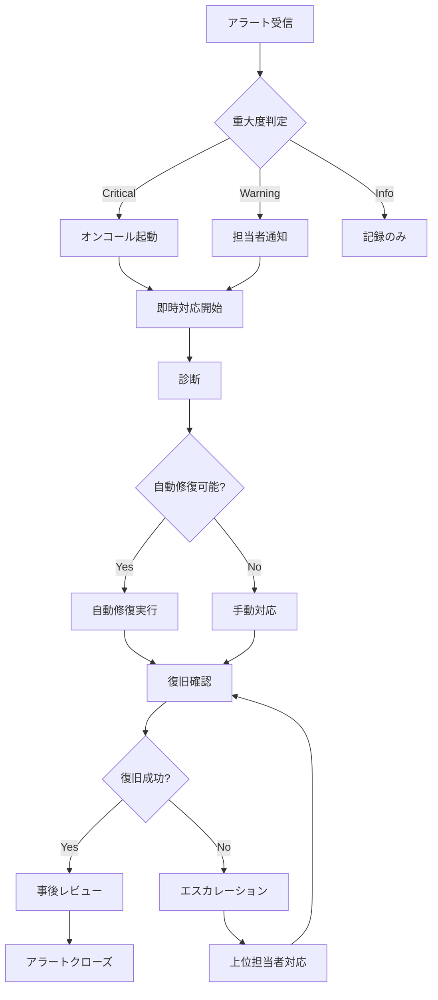

# アラート対応手順 (Alert Response Procedures)

## アラートカテゴリ

### Critical (重大)
- **サービスダウン**: バックエンドサービスが停止
- **データベース接続失敗**: PostgreSQL接続不可
- **ディスク容量90%超**: ストレージ不足

### Warning (警告)
- **API レスポンス遅延**: レスポンスタイム > 5秒
- **メモリ使用率高**: > 80%
- **ログファイルサイズ大**: > 1GB

### Info (情報)
- **定期メンテナンス通知**: メンテナンス開始/終了
- **バックアップ成功/失敗**: バックアップ結果

## アラート一覧

| アラート名 | レベル | 対応時間 | 担当 | 自動対応 |
|-----------|--------|----------|------|----------|
| サービスダウン | Critical | 15分以内 | SRE/DevOps | 自動再起動 |
| データベース接続失敗 | Critical | 15分以内 | DBA | 再接続試行 |
| ディスク容量90%超 | Warning | 1時間以内 | SRE | ログローテーション |
| API レスポンス遅延 | Warning | 2時間以内 | 開発 | パフォーマンス監視 |
| CI/CD 失敗 | Warning | 4時間以内 | 開発 | 再実行 |
| SSL証明書期限切れ間近 | Info | 1営業日以内 | SRE | 自動更新 |

## アラート対応フロー



## アラート対応テンプレート

### アラート: [アラート名]

#### 概要
[アラートの説明]

#### 検知条件
- [ ] 条件1: 説明
- [ ] 条件2: 説明

#### 即時対応手順
1. **診断**
   ```bash
   # サービスステータス確認
   systemctl status mks-backend
   
   # ログ確認
   tail -f /var/log/mks-backend/error.log
   ```

2. **対応**
   ```bash
   # サービス再起動
   sudo systemctl restart mks-backend
   ```

3. **確認**
   ```bash
   # ヘルスチェック
   curl -f http://localhost:5100/api/v1/health
   ```

#### 確認項目
- [ ] サービス起動確認
- [ ] エラーログ確認
- [ ] ユーザー影響確認
- [ ] 監視ダッシュボード確認

#### 担当者
- **プライマリ**: [担当者名]
- **セカンダリ**: [担当者名]
- **エスカレーション**: [上位担当者]

#### 関連リソース
- [ダッシュボードリンク](https://monitoring.example.com)
- [ログ集計リンク](https://logs.example.com)
- [Runbookリンク](./incident-response.md)

## 自動対応設定

### サービス自動再起動
```bash
# systemd設定
[Unit]
StartLimitIntervalSec=300
StartLimitBurst=3

[Service]
Restart=always
RestartSec=30
```

### ログローテーション自動化
```bash
# logrotate設定 (/etc/logrotate.d/mks-backend)
/var/log/mks/*.log {
    daily
    rotate 30
    compress
    missingok
    notifempty
    create 0640 mks mks
    postrotate
        systemctl reload mks-backend
    endscript
}
```

### SSL証明書自動更新
```bash
# certbot設定
certbot renew --quiet --deploy-hook "systemctl reload nginx"
```

## 監視設定

### Prometheus + Grafana
- **エンドポイント**: /metrics
- **ダッシュボード**: Grafana URL
- **アラートルール**: prometheus/rules.yml

### ログ監視
- **ツール**: ELK Stack / Loki
- **フィルタ**: ERROR, CRITICALレベル
- **通知**: Slack/Email

## 定期レビュー

- **毎週**: アラート精度レビュー
- **毎月**: 誤検知率分析
- **毎四半期**: アラートルール最適化</content>
<parameter name="filePath">runbook/alert-response.md