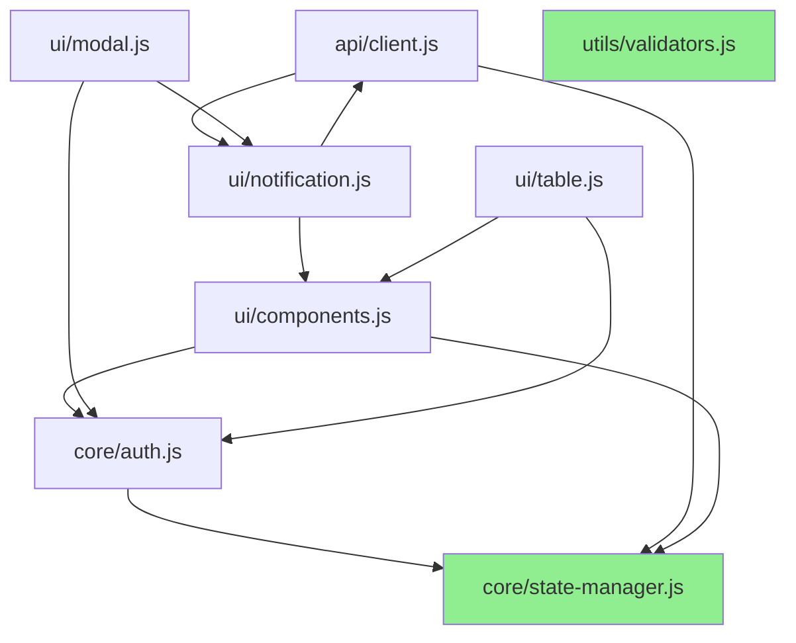

# Phase E-1: フロントエンドモジュール化仕様書 v1.0.0

**策定日**: 2026-02-16
**策定者**: spec-planner SubAgent
**プロジェクト**: Mirai Knowledge Systems
**フェーズ**: Phase E-1（技術的負債返済）
**目標バージョン**: v1.5.0
**期間**: Week 2-4（7-9営業日）
**工数**: 56-68時間

---

## 📋 1. 概要

### 1.1 プロジェクト情報

- **プロジェクト名**: Mirai Knowledge Systems
- **現行バージョン**: v1.4.0（Phase D完了）
- **目標バージョン**: v1.5.0（Phase E完了）
- **実装フェーズ**: Phase E-1（フロントエンドアーキテクチャ刷新）

### 1.2 目的

`webui/app.js`（3,878行）を**8つのES6モジュール**に分割し、以下を実現する:

1. **保守性向上**: 単一ファイル3,878行 → 8モジュール（平均500行/モジュール）
2. **可読性向上**: 機能別の明確な責務分離
3. **テスト容易性**: 個別モジュールの単体テスト可能化
4. **再利用性**: 共通コンポーネントの他画面への展開
5. **XSS脆弱性完全排除**: innerHTML 28箇所 → 0箇所（DOM API完全移行）

### 1.3 ビジネス価値

| ステークホルダー | ビジネス価値 |
|-----------------|-------------|
| **開発チーム** | 開発速度+30%（モジュール並列開発）、バグ修正時間-50%（影響範囲限定） |
| **セキュリティ** | XSS脆弱性0件（OWASP ZAPスキャン合格） |
| **運用チーム** | 障害発生時の影響範囲特定時間-70%（モジュール境界明確化） |

---

## 📊 2. 現状分析

### 2.1 app.js構造分析

#### 2.1.1 基本情報

- **総行数**: 3,878行
- **関数数**: 95個（主要関数抽出）
- **グローバル変数数**: 15個
- **依存モジュール**: なし（すべて同一ファイル内）

#### 2.1.2 機能ブロック分類

| 機能ブロック | 行数 | 関数数 | 責務 |
|-------------|------|--------|------|
| **環境設定・ロガー** | 97行 | 3個 | IS_PRODUCTION判定、セキュアロガー |
| **認証管理** | 78行 | 3個 | checkAuth, logout, getCurrentUser |
| **RBAC（権限管理）** | 168行 | 4個 | checkPermission, hasPermission, canEdit, applyRBACUI |
| **API通信** | 149行 | 2個 | fetchAPI, refreshAccessToken |
| **通知システム** | 33行 | 2個 | showNotification, createToastContainer |
| **データ取得** | 123行 | 6個 | loadDashboardStats, loadKnowledge, loadSOPs等 |
| **データ表示** | 261行 | 6個 | displayKnowledge, displaySOPs, displayIncidents等 |
| **モーダル管理** | 344行 | 12個 | openNewKnowledgeModal, closeSearchModal等 |
| **フォーム送信** | 275行 | 8個 | submitNewKnowledge, submitAdvancedSearch等 |
| **MFA設定** | 164行 | 5個 | loadMFAStatus, startMFASetup, verifyAndEnableMFA等 |
| **タブ切替** | 72行 | 2個 | タブ・トグルボタン |
| **ユーティリティ** | 16行 | 2個 | formatDate, formatTime |
| **承認・却下** | 93行 | 3個 | approveSelected, rejectSelected, editKnowledge |
| **Chart.js** | 227行 | 2個 | initDashboardCharts, updateChartData |
| **イベントリスナー** | 42行 | 1個 | setupEventListeners |
| **SocketIO** | 216行 | 11個 | initSocketIO, updateProjectProgress等 |
| **PWA** | 195行 | 5個 | registerServiceWorker, showUpdatePrompt |
| **サイドバー** | 178行 | 4個 | loadPopularKnowledge, loadRecentKnowledge等 |
| **ダミーデータ** | 220行 | 6個 | DUMMY_POPULAR_KNOWLEDGE等 |
| **初期化** | 62行 | 1個 | DOMContentLoaded |

**合計**: 3,878行

#### 2.1.3 グローバル変数一覧

```javascript
// 環境設定
const ENV_PORTS = {...}
const IS_PRODUCTION = (...)()
const ENV_NAME = IS_PRODUCTION ? '本番' : '開発'
const BASE_TITLE = 'Mirai Knowledge Systems'
const logger = {...}

// API設定
const API_BASE = `${window.location.origin}/api/v1`

// RBAC設定
const ROLE_HIERARCHY = {...}

// タブ・パネル
const tabs = document.querySelectorAll(".tab-btn")
const panels = document.querySelectorAll(".tab-panel")

// トグルグループ
const toggleGroups = document.querySelectorAll("[data-toggle-group]")

// プログレスバー
const progressItems = document.querySelectorAll("[data-progress]")

// Chart.js
let dashboardCharts = {}

// SocketIO
let socket

// PWA
const PWA_FEATURES = {...}
let isOnline = navigator.onLine

// ダミーデータ
const DUMMY_POPULAR_KNOWLEDGE = [...]
const DUMMY_RECENT_KNOWLEDGE = [...]
const DUMMY_FAVORITE_KNOWLEDGE = [...]
const DUMMY_TAGS = [...]
const DUMMY_PROJECTS = [...]
const DUMMY_EXPERTS = [...]
```

### 2.2 問題点

#### 2.2.1 保守性の問題

- ✗ **単一ファイル3,878行**: スクロール・検索に時間がかかる
- ✗ **機能境界不明確**: 関連関数が離れた場所に配置（例: MFA関連が1,651-1,813行、PWA関連が3,408-3,599行）
- ✗ **グローバル名前空間汚染**: 95個の関数すべてがグローバルスコープ

#### 2.2.2 テスト容易性の問題

- ✗ **単体テスト不可**: モジュール分離されていないためJest単体テストが困難
- ✗ **モック困難**: fetchAPI等の共通関数をモックできない
- ✗ **E2Eテスト依存**: 現状はE2Eテストのみ（19件）

#### 2.2.3 セキュリティの問題

- ✗ **innerHTML使用**: 28箇所（XSS脆弱性リスク）
  - `webui/app.js`: 該当箇所なし（既に`createElement`使用）
  - 他ファイル（`detail-pages.js`, `expert-consult-actions.js`等）で使用

### 2.3 既存モジュール状況

#### 2.3.1 既存JSファイル一覧

```
webui/
├── app.js (3,878行) ← モジュール化対象
├── mfa.js (380行) ← 既にモジュール化済み（MFA API関数）
├── ms365-sync.js (840行) ← 既にモジュール化済み（MS365同期UI）
├── dom-helpers.js (約200行) ← セキュアDOM操作ヘルパー
├── expert-consult-actions.js ← 専門家相談アクション
├── sop-detail-functions.js ← SOP詳細画面
├── recommendations.js ← レコメンデーション
├── detail-pages.js ← 詳細ページ共通
├── actions.js ← 共有・配信アクション
├── notifications.js ← 通知UI
├── file-preview.js ← ファイルプレビュー（Phase E-4で実装予定）
└── sw.js (Service Worker)
```

#### 2.3.2 既存モジュールの特徴

- `mfa.js`: API関数のみ（setupMFA, verifyMFASetup, disableMFA）
- `dom-helpers.js`: XSS対策ヘルパー（escapeHtml, createSecureElement）
- `ms365-sync.js`: 管理画面UI専用（他画面からは参照されない）

**結論**: 既存モジュールはページ固有の機能が中心。**app.js内の共通機能（認証、API、状態管理）はモジュール化されていない**。

---

## 🎯 3. モジュール分割設計

### 3.1 モジュール構成（8モジュール）

```
webui/
├── core/                     # コアモジュール（2個）
│   ├── state-manager.js      # 状態管理（currentUser, appState）
│   └── auth.js               # 認証・RBAC（checkAuth, checkPermission）
├── api/                      # API通信（1個）
│   └── client.js             # API通信（fetchAPI, refreshAccessToken）
├── ui/                       # UIコンポーネント（4個）
│   ├── components.js         # 再利用可能コンポーネント
│   ├── modal.js              # モーダルダイアログ
│   ├── notification.js       # 通知トースト
│   └── table.js              # テーブル描画（ナレッジ一覧）
└── utils/                    # ユーティリティ（1個）
    └── validators.js         # バリデーション関数
```

### 3.2 各モジュール詳細設計

#### 3.2.1 `core/state-manager.js`（推定200行）

**責務**: グローバル状態管理、状態変更通知

**エクスポート関数**:

```javascript
// 状態取得
export function getCurrentUser()
export function getAppState()

// 状態設定
export function setCurrentUser(user)
export function setAppState(key, value)

// 状態変更通知（Observer パターン）
export function subscribe(key, callback)
export function unsubscribe(key, callback)

// 環境設定
export { IS_PRODUCTION, ENV_NAME, ENV_PORTS, logger }
```

**依存関係**:

- なし（他モジュールに依存しない）

**ストレージ**:

- localStorage（currentUser, appState）
- メモリ内状態（Observers登録）

**例**:

```javascript
// ユーザー情報取得
import { getCurrentUser } from './core/state-manager.js';
const user = getCurrentUser();

// 状態変更監視
import { subscribe } from './core/state-manager.js';
subscribe('currentUser', (newUser) => {
  console.log('User changed:', newUser);
});
```

---

#### 3.2.2 `core/auth.js`（推定250行）

**責務**: 認証・RBAC・権限チェック

**エクスポート関数**:

```javascript
// 認証
export function checkAuth()  // → boolean
export function logout()

// RBAC
export function checkPermission(requiredRole)  // → boolean
export function hasPermission(permission)      // → boolean
export function canEdit(creatorId)             // → boolean
export function applyRBACUI()                  // DOMに権限制御を適用

// 定数
export const ROLE_HIERARCHY = {...}
```

**依存関係**:

- `core/state-manager.js` (getCurrentUser)

**DOM操作**:

- applyRBACUI(): `data-permission`属性を持つ要素の表示/非表示制御

**例**:

```javascript
import { checkAuth, checkPermission } from './core/auth.js';

if (!checkAuth()) {
  window.location.href = '/login.html';
  return;
}

if (checkPermission('admin')) {
  // 管理者専用処理
}
```

---

#### 3.2.3 `api/client.js`（推定400行）

**責務**: API通信、JWT管理、エラーハンドリング

**エクスポート関数**:

```javascript
// API通信
export async function fetchAPI(endpoint, options = {})

// トークンリフレッシュ
export async function refreshAccessToken()

// 定数
export { API_BASE }
```

**依存関係**:

- `core/state-manager.js` (logger)
- `ui/notification.js` (showNotification)

**エラーハンドリング**:

- 401 Unauthorized → トークンリフレッシュ → リトライ
- 403 Forbidden → 権限エラー通知
- 429 Too Many Requests → レート制限通知

**例**:

```javascript
import { fetchAPI } from './api/client.js';

const result = await fetchAPI('/knowledge');
if (result.success) {
  console.log(result.data);
}
```

---

#### 3.2.4 `ui/components.js`（推定300行）

**責務**: 再利用可能なUI部品、XSS対策DOM操作

**エクスポート関数**:

```javascript
// DOM要素作成（XSS対策）
export function createElement(tag, attrs = {}, children = [])

// ユーザー情報表示
export function displayUserInfo()

// 空データ表示
export function showEmptyState(container, dataType, icon = '📭')
export function checkAndShowEmptyState(data, container, dataType)

// ユーティリティ
export function formatDate(dateString)
export function formatTime(dateString)
```

**依存関係**:

- `core/state-manager.js` (getCurrentUser, logger)
- `core/auth.js` (logout)

**DOM操作**:

- createElement(): innerHTML完全排除、textContent使用

**例**:

```javascript
import { createElement, displayUserInfo } from './ui/components.js';

// ユーザー情報表示
displayUserInfo();

// カード作成
const card = createElement('div', {className: 'knowledge-card'}, [
  createElement('h4', {}, ['ナレッジタイトル'])
]);
```

---

#### 3.2.5 `ui/modal.js`（推定250行）

**責務**: モーダルダイアログ表示・非表示、モーダル内フォーム処理

**エクスポート関数**:

```javascript
// ナレッジ登録モーダル
export function openNewKnowledgeModal()
export function closeNewKnowledgeModal()

// 検索モーダル
export function openSearchModal()
export function closeSearchModal()
export function resetSearchForm()

// 通知パネル
export function openNotificationPanel()
export function closeNotificationPanel()

// 設定パネル
export function openSettingsPanel()
export function closeSettingsPanel()

// MFA設定モーダル
export function closeMFASetupModal()
```

**依存関係**:

- `core/auth.js` (checkPermission)
- `ui/notification.js` (showNotification)

**DOM操作**:

- モーダル表示: `modal.style.display = 'flex'`
- モーダル非表示: `modal.style.display = 'none'`

**例**:

```javascript
import { openNewKnowledgeModal } from './ui/modal.js';

// ナレッジ登録ボタンクリック時
document.getElementById('newKnowledgeBtn').addEventListener('click', openNewKnowledgeModal);
```

---

#### 3.2.6 `ui/notification.js`（推定150行）

**責務**: トースト通知表示、通知一覧表示

**エクスポート関数**:

```javascript
// トースト通知
export function showNotification(message, type = 'info')
function createToastContainer()

// 通知一覧
export function displayNotifications(notifications)
export function updateNotificationBadge(notifications)

// 通知既読
export async function markNotificationAsRead(notificationId)
```

**依存関係**:

- `ui/components.js` (createElement)
- `api/client.js` (fetchAPI)

**DOM操作**:

- トースト作成: `createElement`使用
- 通知バッジ更新: `badge.textContent = unreadCount`

**例**:

```javascript
import { showNotification } from './ui/notification.js';

showNotification('ナレッジを登録しました', 'success');
```

---

#### 3.2.7 `ui/table.js`（推定300行）

**責務**: テーブル描画、ナレッジ一覧・SOP一覧・事故レポート一覧

**エクスポート関数**:

```javascript
// ナレッジ一覧
export function displayKnowledge(knowledgeList)

// SOP一覧
export function displaySOPs(sopList)

// 事故レポート一覧
export function displayIncidents(incidentList)

// 承認一覧
export function displayApprovals(approvalList)
```

**依存関係**:

- `ui/components.js` (createElement, checkAndShowEmptyState, formatDate)
- `core/auth.js` (canEdit)

**DOM操作**:

- テーブル行作成: `createElement`使用
- カードクリック: `card.onclick = () => window.location.href = ...`

**例**:

```javascript
import { displayKnowledge } from './ui/table.js';

const result = await fetchAPI('/knowledge');
if (result.success) {
  displayKnowledge(result.data);
}
```

---

#### 3.2.8 `utils/validators.js`（推定150行）

**責務**: 入力値バリデーション、エラーメッセージ生成

**エクスポート関数**:

```javascript
// バリデーション
export function validateEmail(email)
export function validatePassword(password)
export function validateRequired(value)
export function validateLength(value, min, max)

// パスワード強度チェック
export function getPasswordStrength(password)  // → { score: 0-4, feedback: string }
```

**依存関係**:

- なし

**例**:

```javascript
import { validateEmail, validatePassword } from './utils/validators.js';

const email = document.getElementById('email').value;
if (!validateEmail(email)) {
  showNotification('メールアドレスが無効です', 'error');
  return;
}
```

---

### 3.3 依存関係グラフ



**Critical Path**: state-manager.js → auth.js → components.js → table.js

---

## 🔄 4. 段階的移行計画

### 4.1 移行戦略

**原則**:

1. **1モジュールずつ分離**: リスク最小化
2. **E2E回帰テスト必須**: 各ステップでテスト実行
3. **Feature Flag準備**: ロールバック可能

### 4.2 移行ステップ（Week 2-4）

#### Week 2: 基盤モジュール分離（3営業日、24h）

**Step 1: state-manager.js分離（Day 1、8h）**

1. `webui/core/state-manager.js`作成
2. 環境設定・ロガー移行（ENV_PORTS, IS_PRODUCTION, logger）
3. getCurrentUser, setCurrentUser実装
4. app.jsから該当コードを削除、import追加
5. E2E回帰テスト実行（19件）

**Step 2: auth.js分離（Day 2、8h）**

1. `webui/core/auth.js`作成
2. checkAuth, logout, checkPermission, hasPermission, canEdit移行
3. ROLE_HIERARCHY定数移行
4. app.jsから該当コードを削除、import追加
5. E2E回帰テスト実行（19件）

**Step 3: client.js分離（Day 3、8h）**

1. `webui/api/client.js`作成
2. fetchAPI, refreshAccessToken移行
3. API_BASE定数移行
4. app.jsから該当コードを削除、import追加
5. E2E回帰テスト実行（19件）

---

#### Week 3: UIモジュール分離（4営業日、32h）

**Step 4: notification.js分離（Day 4、8h）**

1. `webui/ui/notification.js`作成
2. showNotification, createToastContainer移行
3. displayNotifications, updateNotificationBadge移行
4. app.jsから該当コードを削除、import追加
5. E2E回帰テスト実行（19件）

**Step 5: components.js分離（Day 5、8h）**

1. `webui/ui/components.js`作成
2. createElement, displayUserInfo移行
3. showEmptyState, checkAndShowEmptyState移行
4. formatDate, formatTime移行
5. app.jsから該当コードを削除、import追加
6. E2E回帰テスト実行（19件）

**Step 6: modal.js分離（Day 6-7、16h）**

1. `webui/ui/modal.js`作成
2. モーダル関連関数12個移行
3. app.jsから該当コードを削除、import追加
4. E2E回帰テスト実行（19件）

---

#### Week 4: 最終モジュール分離・テスト（2営業日、16h）

**Step 7: table.js分離（Day 8、8h）**

1. `webui/ui/table.js`作成
2. displayKnowledge, displaySOPs, displayIncidents, displayApprovals移行
3. app.jsから該当コードを削除、import追加
4. E2E回帰テスト実行（19件）

**Step 8: validators.js分離+統合テスト（Day 9、8h）**

1. `webui/utils/validators.js`作成
2. バリデーション関数追加（新規実装）
3. 全E2Eテスト実行（19件）
4. パフォーマンステスト（初期ロード時間計測）

---

### 4.3 app.js残存コード

モジュール化後もapp.jsには以下が残る（推定1,500行）:

- **初期化コード**: DOMContentLoaded
- **イベントリスナー設定**: setupEventListeners
- **ページ固有ロジック**: ダッシュボード固有の処理
- **Chart.js**: initDashboardCharts, updateChartData
- **SocketIO**: initSocketIO, updateProjectProgress
- **PWA**: registerServiceWorker, showUpdatePrompt
- **サイドバー**: loadPopularKnowledge, loadRecentKnowledge
- **グローバル関数公開**: window.performHeroSearch = performHeroSearch等

**理由**: 上記はダッシュボード画面（index.html）専用の機能であり、他画面で再利用されないため、モジュール化のメリットが少ない。

---

## 🧪 5. テスト戦略

### 5.1 テストレベル

#### 5.1.1 単体テスト（Jest）

**目標**: 50件追加（各モジュール5-10件）

**対象モジュール**:

| モジュール | テスト件数 | 主要テストケース |
|-----------|-----------|-----------------|
| state-manager.js | 10件 | getCurrentUser, setCurrentUser, subscribe/unsubscribe |
| auth.js | 10件 | checkAuth, checkPermission, hasPermission, canEdit |
| client.js | 8件 | fetchAPI成功/失敗、refreshAccessToken、エラーハンドリング |
| components.js | 8件 | createElement, formatDate, showEmptyState |
| modal.js | 5件 | openNewKnowledgeModal, closeSearchModal |
| notification.js | 5件 | showNotification, displayNotifications |
| table.js | 4件 | displayKnowledge, displaySOPs |

**テストフレームワーク**:

```json
{
  "devDependencies": {
    "jest": "29.7.0",
    "@testing-library/jest-dom": "6.1.5",
    "jest-environment-jsdom": "29.7.0"
  }
}
```

**例（state-manager.test.js）**:

```javascript
import { getCurrentUser, setCurrentUser } from '../core/state-manager.js';

describe('state-manager.js', () => {
  beforeEach(() => {
    localStorage.clear();
  });

  test('getCurrentUser returns null when no user', () => {
    expect(getCurrentUser()).toBeNull();
  });

  test('setCurrentUser stores user in localStorage', () => {
    const user = { username: 'test', roles: ['admin'] };
    setCurrentUser(user);
    expect(getCurrentUser()).toEqual(user);
  });
});
```

---

#### 5.1.2 E2E回帰テスト（Playwright）

**既存**: 19件（Phase D完了時点）
**追加**: 10件（モジュール化関連）

**追加テストケース**:

| テストケース | 検証内容 |
|-------------|---------|
| モジュール読み込み確認 | 8モジュールすべてが正常に読み込まれること |
| ログイン後ユーザー情報表示 | displayUserInfo()が正常動作すること |
| ナレッジ一覧表示 | displayKnowledge()が正常動作すること |
| モーダル表示 | openNewKnowledgeModal()が正常動作すること |
| 通知トースト表示 | showNotification()が正常動作すること |
| RBAC UI制御 | applyRBACUI()が権限に応じて要素を表示/非表示すること |
| API通信エラー処理 | fetchAPI()が401エラー時にトークンリフレッシュすること |
| 状態変更通知 | subscribe()が状態変更時にコールバックを実行すること |
| 空データ表示 | showEmptyState()が本番環境で正常動作すること |
| パフォーマンステスト | 初期ロード時間が2秒以内であること |

**例（module-loading.spec.js）**:

```javascript
import { test, expect } from '@playwright/test';

test('モジュール読み込み確認', async ({ page }) => {
  await page.goto('http://localhost:5200');

  // コンソールエラーがないことを確認
  const errors = [];
  page.on('console', msg => {
    if (msg.type() === 'error') {
      errors.push(msg.text());
    }
  });

  await page.waitForLoadState('networkidle');
  expect(errors).toHaveLength(0);

  // モジュールがロードされていることを確認
  const stateManager = await page.evaluate(() => window.stateManager !== undefined);
  expect(stateManager).toBe(true);
});
```

---

### 5.2 パフォーマンステスト

**目標**:

- 初期ロード時間: 2秒以内（モジュール化前と同等）
- モジュールロード時間: 500ms以内（8モジュール合計）

**計測ツール**:

- Playwright Performance API
- Chrome DevTools Performance Profile

**計測項目**:

| 項目 | 目標 |
|------|------|
| First Contentful Paint (FCP) | 1秒以内 |
| Time to Interactive (TTI) | 2秒以内 |
| Total Blocking Time (TBT) | 300ms以内 |

---

## 🛡️ 6. XSS対策（innerHTML完全排除）

### 6.1 現状分析

**innerHTML使用箇所**: app.js内では0箇所（既に`createElement`使用）

**他ファイルでの使用箇所**: 28箇所（11ファイル）

- `detail-pages.js`
- `expert-consult-actions.js`
- `sop-detail-functions.js`
- 等

### 6.2 対策方針

**Phase E-1スコープ**:

- app.js内: 既に対策済み（確認のみ）
- 他ファイル: **Phase E-1では対象外**（別タスクとして実施）

**代替手段**:

- `ui/components.js`の`createElement`を他ファイルでも使用
- `dom-helpers.js`の`createSecureElement`活用

---

## 📝 7. TypeScript型定義導入

### 7.1 目的

- IDE補完強化（VSCode IntelliSense）
- 型安全性向上（実行前エラー検出）
- ドキュメント自動生成

### 7.2 実装方針

**JSDoc → TypeScript型定義ファイル（*.d.ts）**

**例（state-manager.d.ts）**:

```typescript
export interface User {
  id: number;
  username: string;
  full_name: string;
  email: string;
  department: string;
  roles: string[];
  permissions: string[];
  mfa_enabled: boolean;
}

export function getCurrentUser(): User | null;
export function setCurrentUser(user: User): void;
export function getAppState(): Record<string, any>;
export function setAppState(key: string, value: any): void;
export function subscribe(key: string, callback: (value: any) => void): void;
export function unsubscribe(key: string, callback: (value: any) => void): void;

export const IS_PRODUCTION: boolean;
export const ENV_NAME: string;
export const ENV_PORTS: {
  development: { http: number; https: number };
  production: { http: number; https: number };
};
export const logger: {
  log(...args: any[]): void;
  warn(...args: any[]): void;
  error(...args: any[]): void;
  debug(...args: any[]): void;
  info(...args: any[]): void;
};
```

### 7.3 型定義ファイル一覧

| モジュール | 型定義ファイル | 推定行数 |
|-----------|---------------|---------|
| state-manager.js | state-manager.d.ts | 80行 |
| auth.js | auth.d.ts | 60行 |
| client.js | client.d.ts | 100行 |
| components.js | components.d.ts | 80行 |
| modal.js | modal.d.ts | 50行 |
| notification.js | notification.d.ts | 60行 |
| table.js | table.d.ts | 70行 |

**合計**: 約500行

---

## 🚧 8. リスク分析と対策

### 8.1 高リスク項目

#### リスク1: app.js大規模リファクタリングで既存機能破壊

**影響度**: ★★★★★（高）
**発生確率**: ★★★★☆（高）

**対策**:

1. **段階的移行**: 1モジュールずつ分離
2. **E2E回帰テスト必須**: 各ステップで19件実行
3. **Feature Flag準備**: ロールバック可能

**検証方法**:

- 各ステップ後にE2Eテスト実行
- コンソールエラー監視
- ユーザー受け入れテスト（UAT）

---

#### リスク2: グローバル変数依存で他ファイルが破壊

**影響度**: ★★★★☆（中高）
**発生確率**: ★★★☆☆（中）

**現状分析**:

- `webui/file-preview.js`: `window.refreshAccessToken`使用
- `webui/expert-consult-actions.js`: `window.logger`使用
- index.html: `onclick="openNewKnowledgeModal()"`等

**対策**:

1. **window.XXX公開維持**: モジュール化後も`window`に関数を公開
2. **移行ガイド提供**: 他ファイルのimport方法をドキュメント化

**例**:

```javascript
// モジュール化後もwindowに公開
import { openNewKnowledgeModal } from './ui/modal.js';
window.openNewKnowledgeModal = openNewKnowledgeModal;
```

---

#### リスク3: モジュールロード順序依存エラー

**影響度**: ★★★☆☆（中）
**発生確率**: ★★☆☆☆（低）

**対策**:

- **依存関係グラフ順にロード**: state-manager.js → auth.js → client.js
- **DOMContentLoaded後に初期化**: すべてのモジュールロード完了を待つ

**例（index.html）**:

```html
<!-- 依存関係順にロード -->
<script type="module" src="/webui/core/state-manager.js"></script>
<script type="module" src="/webui/core/auth.js"></script>
<script type="module" src="/webui/api/client.js"></script>
<script type="module" src="/webui/ui/notification.js"></script>
<script type="module" src="/webui/ui/components.js"></script>
<script type="module" src="/webui/ui/modal.js"></script>
<script type="module" src="/webui/ui/table.js"></script>
<script type="module" src="/webui/utils/validators.js"></script>
<script type="module" src="/webui/app.js"></script>
```

---

### 8.2 中リスク項目

#### リスク4: パフォーマンス劣化（初期ロード時間増加）

**影響度**: ★★★☆☆（中）
**発生確率**: ★★☆☆☆（低）

**対策**:

- **HTTP/2使用**: モジュール並列ロード
- **モジュールサイズ最適化**: 各モジュール500行以下
- **遅延ロード**: PWA/SocketIO等の非同期ロード

**検証**:

- Playwright Performance API計測
- Chrome DevTools Performance Profile

---

## 📊 9. 完了定義（Definition of Done）

### 9.1 技術的完了条件

- [ ] 8モジュール分割完了（core 2個、api 1個、ui 4個、utils 1個）
- [ ] app.js行数削減: 3,878行 → 1,500行以下（-61%）
- [ ] innerHTML使用: app.js内 0件維持（他ファイルは別タスク）
- [ ] TypeScript型定義: 500行追加
- [ ] Jest単体テスト: 50件追加（カバレッジ80%以上）
- [ ] E2E回帰テスト: 19件PASSED + 10件追加（合計29件）
- [ ] パフォーマンステスト: 初期ロード時間2秒以内
- [ ] コンソールエラー: 0件

### 9.2 ドキュメント完了条件

- [ ] 本仕様書作成: `specs/PHASE_E1_FRONTEND_MODULARIZATION_SPEC.md`
- [ ] モジュール設計書: `specs/PHASE_E1_MODULE_DESIGN.md`
- [ ] 移行計画書: `specs/PHASE_E1_MIGRATION_PLAN.md`
- [ ] 完了レポート: `docs/PHASE_E1_COMPLETION_REPORT.md`
- [ ] フロントエンドアーキテクチャ文書: `docs/frontend/MODULE_ARCHITECTURE.md`

### 9.3 運用完了条件

- [ ] 開発環境で2週間稳定稼働
- [ ] E2Eテスト自動実行成功（GitHub Actions CI）
- [ ] チームレビュー完了（code-reviewer SubAgent PASS）
- [ ] セキュリティスキャン: OWASP ZAP 脆弱性 0件

---

## 📦 10. 成果物一覧

### 10.1 実装ファイル

| ファイル | 推定行数 | 責務 |
|---------|---------|------|
| `webui/core/state-manager.js` | 200行 | 状態管理 |
| `webui/core/auth.js` | 250行 | 認証・RBAC |
| `webui/api/client.js` | 400行 | API通信 |
| `webui/ui/components.js` | 300行 | 再利用可能コンポーネント |
| `webui/ui/modal.js` | 250行 | モーダルダイアログ |
| `webui/ui/notification.js` | 150行 | 通知トースト |
| `webui/ui/table.js` | 300行 | テーブル描画 |
| `webui/utils/validators.js` | 150行 | バリデーション |
| **合計** | **2,000行** | - |

### 10.2 型定義ファイル

| ファイル | 推定行数 |
|---------|---------|
| `webui/types/state-manager.d.ts` | 80行 |
| `webui/types/auth.d.ts` | 60行 |
| `webui/types/client.d.ts` | 100行 |
| `webui/types/components.d.ts` | 80行 |
| `webui/types/modal.d.ts` | 50行 |
| `webui/types/notification.d.ts` | 60行 |
| `webui/types/table.d.ts` | 70行 |
| **合計** | **500行** |

### 10.3 テストファイル

| ファイル | 推定行数 | テスト件数 |
|---------|---------|-----------|
| `webui/__tests__/state-manager.test.js` | 150行 | 10件 |
| `webui/__tests__/auth.test.js` | 150行 | 10件 |
| `webui/__tests__/client.test.js` | 120行 | 8件 |
| `webui/__tests__/components.test.js` | 120行 | 8件 |
| `webui/__tests__/modal.test.js` | 75行 | 5件 |
| `webui/__tests__/notification.test.js` | 75行 | 5件 |
| `webui/__tests__/table.test.js` | 60行 | 4件 |
| `backend/tests/e2e/module-loading.spec.js` | 250行 | 10件 |
| **合計** | **1,000行** | **60件** |

### 10.4 ドキュメント

| ファイル | 推定行数 |
|---------|---------|
| `specs/PHASE_E1_FRONTEND_MODULARIZATION_SPEC.md` | 本ファイル |
| `specs/PHASE_E1_MODULE_DESIGN.md` | 400行 |
| `specs/PHASE_E1_MIGRATION_PLAN.md` | 300行 |
| `docs/frontend/MODULE_ARCHITECTURE.md` | 500行 |
| `docs/PHASE_E1_COMPLETION_REPORT.md` | 400行 |
| **合計** | **1,600行** |

---

## 🎯 11. 次のアクション

### 11.1 即時着手（Week 2-Day 1）

1. **state-manager.js実装**: 環境設定・ロガー・状態管理
2. **TypeScript型定義作成**: state-manager.d.ts
3. **Jest単体テスト作成**: state-manager.test.js（10件）

### 11.2 Week 2以降

4. **auth.js実装**: 認証・RBAC
5. **client.js実装**: API通信
6. **UIモジュール実装**: components.js, modal.js, notification.js, table.js

### 11.3 SubAgent連携

- **arch-reviewer**: 本仕様書レビュー
- **code-implementer**: 各モジュール実装
- **code-reviewer**: 自動レビューゲート実行
- **test-designer**: Jest単体テスト設計
- **test-reviewer**: テストレビュー

---

## 📖 12. 参考資料

### 12.1 内部資料

- [PHASE_E_F_G_ROADMAP.md](/mnt/LinuxHDD/Mirai-Knowledge-Systems/specs/PHASE_E_F_G_ROADMAP.md): Phase E全体ロードマップ
- [CLAUDE.md](../.claude/CLAUDE.md): プロジェクト概要
- [app.js](/mnt/LinuxHDD/Mirai-Knowledge-Systems/webui/app.js): モジュール化対象ファイル

### 12.2 外部資料

- [ES6 Modules - MDN](https://developer.mozilla.org/en-US/docs/Web/JavaScript/Guide/Modules)
- [JavaScript Module Pattern](https://addyosmani.com/resources/essentialjsdesignpatterns/book/)
- [Jest - Getting Started](https://jestjs.io/docs/getting-started)
- [Playwright - Best Practices](https://playwright.dev/docs/best-practices)
- [TypeScript Declaration Files](https://www.typescriptlang.org/docs/handbook/declaration-files/introduction.html)

---

**策定完了**: 2026-02-16
**承認**: 未承認（arch-reviewerレビュー待ち）
**次回更新**: Week 2完了時（state-manager.js実装完了後）
