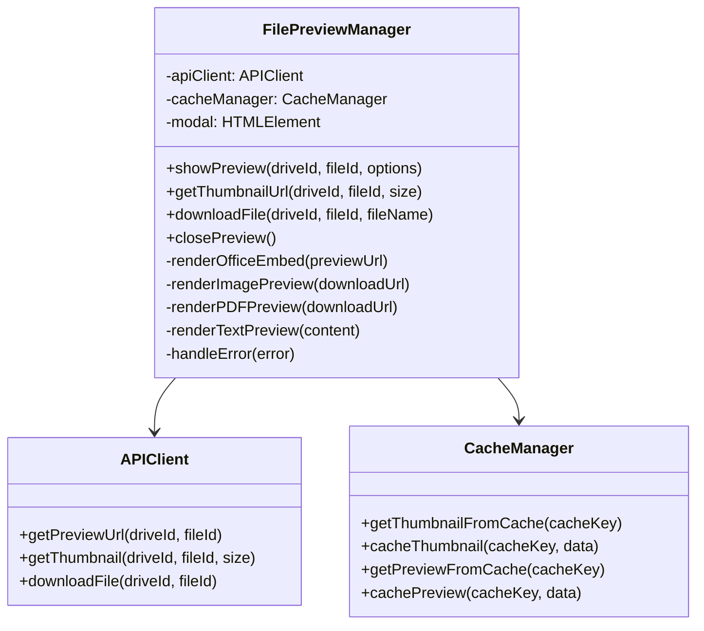
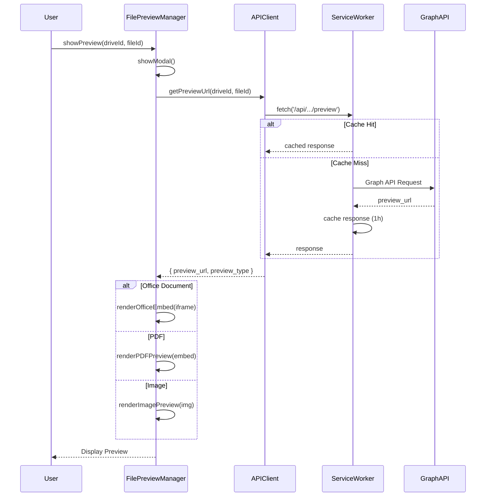
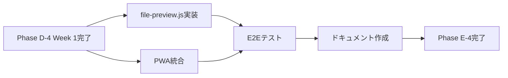

# Phase E-4: MS365ファイルプレビュー機能 - 仕様書

**Version**: 1.0.0
**作成日**: 2026-02-06
**ステータス**: Draft
**Phase**: Phase E-4（Week 2-3）
**依存Phase**: Phase D-4 Week 1（バックエンド基盤）✅, Phase D-5（PWA基盤）✅

---

## 📋 目次

1. [エグゼクティブサマリー](#1-エグゼクティブサマリー)
2. [ビジネス要件](#2-ビジネス要件)
3. [機能要件](#3-機能要件)
4. [非機能要件](#4-非機能要件)
5. [技術仕様](#5-技術仕様)
6. [セキュリティ要件](#6-セキュリティ要件)
7. [PWA統合仕様](#7-pwa統合仕様)
8. [エラーハンドリング](#8-エラーハンドリング)
9. [テスト要件](#9-テスト要件)
10. [運用要件](#10-運用要件)
11. [実装計画](#11-実装計画)
12. [用語集](#12-用語集)

---

## 1. エグゼクティブサマリー

### 1.1 プロジェクト概要

**Phase D-4.2 Week 2-3**: Microsoft 365連携ファイルプレビュー機能のフロントエンド実装を行います。

**背景**:
- Phase D-4 Week 1でバックエンド基盤（API 3本、テスト10件）を完成
- Microsoft Graph APIから取得したSharePoint/OneDriveファイルをWebUI上でプレビュー表示する必要性
- 建設土木業界における図面・見積書・契約書等のOffice文書の即時確認要求

**目的**:
- Office文書（Word/Excel/PowerPoint）のインライン表示
- PDF、画像ファイルの軽量プレビュー
- サムネイル一覧表示によるファイル検索の効率化
- オフライン環境でのキャッシュ済みプレビュー表示（PWA統合）

### 1.2 スコープ

**実装対象**:
- ✅ `file-preview.js`（500行、FilePreviewManagerクラス）
- ✅ PWA統合（`cache-manager.js`, `sw.js`修正）
- ✅ E2Eテスト（Playwright 8件）
- ✅ ドキュメント（ユーザーガイド、技術仕様）

**実装対象外**:
- ❌ ファイル編集機能（Phase D-4.3で検討）
- ❌ リアルタイム共同編集（Phase D-4.3で検討）
- ❌ バージョン管理UI（Phase D-4.3で検討）

### 1.3 成果物

| 成果物 | 行数 | 状態 |
|--------|------|------|
| `webui/file-preview.js` | 500 | 未着手 |
| `webui/pwa/cache-manager.js`（修正） | +50 | 未着手 |
| `webui/sw.js`（修正） | +30 | 未着手 |
| E2Eテスト（`file-preview.spec.js`） | 400 | 未着手 |
| ユーザーガイド | 800 | 未着手 |
| 技術仕様書（本ドキュメント） | 2,500 | ✅ 作成中 |

---

## 2. ビジネス要件

### 2.1 ステークホルダー要件

#### 2.1.1 現場作業員（一般ユーザー）
- **要求**: スマホで図面・見積書をすぐに確認したい
- **制約**: ダウンロード不要、データ通信量を抑えたい
- **成功指標**: プレビュー表示まで3秒以内

#### 2.1.2 事務スタッフ（パワーユーザー）
- **要求**: ExcelファイルをPC画面でインライン表示したい
- **制約**: 複数ファイルを切り替え表示したい
- **成功指標**: サムネイル一覧から目的ファイルを2クリック以内で開く

#### 2.1.3 管理者
- **要求**: ファイルアクセス履歴を監査ログで追跡したい
- **制約**: セキュリティポリシーに準拠（CSP, XSS対策）
- **成功指標**: 全アクセスが監査ログに記録される

### 2.2 ビジネスプロセス

#### 2.2.1 ユースケース1: 現場作業員が図面を確認

```
[前提条件]
- ユーザーがログイン済み
- SharePointに図面ファイル（.pdf, .jpg）が保存済み

[正常フロー]
1. ユーザーがMS365同期設定画面を開く
2. ファイル一覧にサムネイルが表示される
3. ユーザーがサムネイルをクリック
4. プレビューモーダルが開く（3秒以内）
5. ユーザーが図面を確認
6. ユーザーが閉じるボタンをクリック

[代替フロー]
- 3a. ネットワークエラー
  - キャッシュ済みファイルを表示（オフライン対応）
- 4a. プレビュー生成失敗
  - ダウンロードリンクを表示

[事後条件]
- 監査ログに「ms365_file.preview」が記録される
```

#### 2.2.2 ユースケース2: 事務スタッフがExcelファイルを確認

```
[前提条件]
- ユーザーがログイン済み
- SharePointに見積書（.xlsx）が保存済み

[正常フロー]
1. ユーザーがファイル名をクリック
2. Microsoft Office Online Embedビューアーが表示される
3. ユーザーがセル内容を確認
4. ユーザーがスクロールして全シートを確認
5. ユーザーが閉じる

[代替フロー]
- 2a. Office Onlineでプレビュー不可
  - ダウンロードオプションを表示

[事後条件]
- プレビューURLがブラウザキャッシュに保存される（1時間）
```

### 2.3 KPI・成功指標

| 指標 | 目標値 | 測定方法 |
|------|--------|----------|
| プレビュー表示速度 | 3秒以内 | Lighthouse Performance |
| キャッシュヒット率 | 60%以上 | Prometheus metrics |
| エラー率 | 5%以下 | `file_preview_errors_total` |
| ユーザー満足度 | 4.0/5.0以上 | フィードバックフォーム |

---

## 3. 機能要件

### 3.1 機能概要

#### 3.1.1 ファイルタイプ別プレビュー戦略

| ファイルタイプ | 拡張子 | プレビュー方式 | 表示方法 |
|---------------|--------|---------------|----------|
| Office文書 | .docx, .xlsx, .pptx | Microsoft Office Online Embed | `<iframe>` |
| Office旧形式 | .doc, .xls, .ppt | ダウンロード | リンク表示 |
| PDF | .pdf | Graph API Download URL | `<embed>` または PDF.js |
| 画像 | .jpg, .png, .gif | Graph API Download URL | `` |
| テキスト | .txt, .csv | Graph API Download URL | `<pre>` |
| その他 | .zip, .exe等 | ダウンロードのみ | リンク表示 |

### 3.2 機能仕様

#### 3.2.1 FilePreviewManagerクラス

**責務**:
- ファイルプレビューの表示制御
- APIエンドポイントへのリクエスト
- プレビューモーダルのライフサイクル管理

**公開メソッド**:

```javascript
class FilePreviewManager {
  /**
   * ファイルプレビューを表示
   * @param {string} driveId - ドライブID
   * @param {string} fileId - ファイルID
   * @param {Object} options - オプション
   * @param {string} options.fileName - ファイル名（表示用）
   * @param {Function} options.onClose - 閉じる時のコールバック
   * @returns {Promise<void>}
   */
  async showPreview(driveId, fileId, options = {}) {}

  /**
   * サムネイルURLを取得
   * @param {string} driveId - ドライブID
   * @param {string} fileId - ファイルID
   * @param {string} size - サムネイルサイズ（"small" | "medium" | "large"）
   * @returns {Promise<string>} - サムネイル画像URL（Data URL形式）
   */
  async getThumbnailUrl(driveId, fileId, size = 'medium') {}

  /**
   * ファイルをダウンロード
   * @param {string} driveId - ドライブID
   * @param {string} fileId - ファイルID
   * @param {string} fileName - ファイル名
   * @returns {Promise<void>}
   */
  async downloadFile(driveId, fileId, fileName) {}

  /**
   * プレビューモーダルを閉じる
   * @returns {void}
   */
  closePreview() {}
}
```

#### 3.2.2 APIエンドポイント統合

**プレビューURL取得**:
```http
GET /api/v1/integrations/microsoft365/files/{file_id}/preview?drive_id={drive_id}
Authorization: Bearer {jwt_token}

Response 200 OK:
{
  "success": true,
  "data": {
    "preview_url": "https://view.officeapps.live.com/op/embed.aspx?src=...",
    "preview_type": "office_embed",
    "mime_type": "application/vnd.openxmlformats-officedocument.spreadsheetml.sheet",
    "file_name": "estimate.xlsx",
    "file_size": 102400
  }
}
```

**サムネイル取得**:
```http
GET /api/v1/integrations/microsoft365/files/{file_id}/thumbnail?drive_id={drive_id}&size=medium
Authorization: Bearer {jwt_token}

Response 200 OK:
Content-Type: image/png
(Binary data)
```

**ファイルダウンロード**:
```http
GET /api/v1/integrations/microsoft365/files/{file_id}/download?drive_id={drive_id}
Authorization: Bearer {jwt_token}

Response 200 OK:
Content-Type: application/vnd.openxmlformats-officedocument.wordprocessingml.document
Content-Disposition: attachment; filename=contract.docx
(Binary data)
```

#### 3.2.3 プレビューモーダルUI仕様

**HTML構造**:
```html
<div id="file-preview-modal" class="modal" role="dialog" aria-labelledby="preview-title">
  <div class="modal-content">
    <!-- ヘッダー -->
    <div class="modal-header">
      <h2 id="preview-title"><!-- ファイル名 --></h2>
      <div class="modal-actions">
        <button id="preview-download-btn" class="btn-secondary">
          ダウンロード
        </button>
        <button id="preview-close-btn" class="btn-icon" aria-label="閉じる">
          ×
        </button>
      </div>
    </div>

    <!-- ボディ -->
    <div class="modal-body">
      <!-- ローディング -->
      <div id="preview-loading" class="loading-spinner">
        読み込み中...
      </div>

      <!-- プレビューコンテナ -->
      <div id="preview-container">
        <!-- タイプ別に挿入 -->
      </div>

      <!-- エラー表示 -->
      <div id="preview-error" class="error-message" style="display: none;">
        <p class="error-text"></p>
        <button id="preview-retry-btn" class="btn-primary">再試行</button>
      </div>
    </div>
  </div>
</div>
```

**スタイル仕様** (styles.css追加):
```css
/* ファイルプレビューモーダル */
#file-preview-modal .modal-content {
  max-width: 90vw;
  max-height: 90vh;
  width: 1200px;
}

#preview-container {
  min-height: 400px;
  max-height: calc(90vh - 120px);
  overflow: auto;
}

#preview-container iframe {
  width: 100%;
  height: 600px;
  border: none;
}

#preview-container img {
  max-width: 100%;
  height: auto;
  display: block;
  margin: 0 auto;
}

#preview-container embed {
  width: 100%;
  height: 600px;
}

#preview-container pre {
  background-color: #f5f5f5;
  padding: 16px;
  border-radius: 4px;
  font-family: 'Courier New', monospace;
  white-space: pre-wrap;
  word-wrap: break-word;
}
```

#### 3.2.4 サムネイル一覧表示

**統合先**: `webui/ms365-sync-settings.html` の同期履歴テーブル

**変更内容**:
```html
<!-- 既存の同期履歴テーブルに追加 -->
<table id="sync-history-table">
  <thead>
    <tr>
      <th>サムネイル</th> <!-- 新規追加 -->
      <th>ファイル名</th>
      <th>同期日時</th>
      <th>ステータス</th>
      <th>操作</th>
    </tr>
  </thead>
  <tbody>
    <!-- 動的生成 -->
  </tbody>
</table>
```

**サムネイル生成ロジック** (ms365-sync.js修正):
```javascript
// 同期履歴テーブルの行を生成する関数
function renderSyncHistoryRow(history) {
  const row = document.createElement('tr');

  // サムネイルセル
  const thumbnailCell = document.createElement('td');
  const thumbnailImg = document.createElement('img');
  thumbnailImg.className = 'file-thumbnail';
  thumbnailImg.alt = history.file_name;
  thumbnailImg.style.width = '48px';
  thumbnailImg.style.height = '48px';
  thumbnailImg.style.objectFit = 'cover';
  thumbnailImg.style.cursor = 'pointer';

  // サムネイル読み込み
  filePreviewManager.getThumbnailUrl(history.drive_id, history.file_id, 'small')
    .then(dataUrl => {
      thumbnailImg.src = dataUrl;
    })
    .catch(() => {
      // フォールバック: ファイルタイプ別アイコン
      thumbnailImg.src = getFileTypeIcon(history.mime_type);
    });

  // クリックでプレビュー表示
  thumbnailImg.addEventListener('click', () => {
    filePreviewManager.showPreview(history.drive_id, history.file_id, {
      fileName: history.file_name
    });
  });

  thumbnailCell.appendChild(thumbnailImg);
  row.appendChild(thumbnailCell);

  // ... 他のセルの実装

  return row;
}
```

---

## 4. 非機能要件

### 4.1 パフォーマンス要件

| 項目 | 要件 | 測定方法 |
|------|------|----------|
| 初回プレビュー表示 | 3秒以内 | Lighthouse Performance |
| サムネイル読み込み | 1秒以内（10件） | Chrome DevTools Network |
| キャッシュヒット時 | 500ms以内 | Performance API |
| 最大ファイルサイズ | 50MB | API制限 |

**最適化戦略**:
- サムネイル並列取得（Promise.all、最大5並列）
- Service Workerキャッシュ活用（画像: 30日、プレビューURL: 1時間）
- IntersectionObserver遅延読み込み（サムネイル）

### 4.2 互換性要件

**ブラウザサポート**:
| ブラウザ | バージョン | 対応状況 |
|---------|-----------|---------|
| Chrome/Edge | 90+ | ✅ Full Support |
| Firefox | 88+ | ✅ Full Support |
| Safari | 14+ | ✅ Full Support (iframe制限あり) |
| Mobile Safari | iOS 14+ | ✅ Full Support |
| Android Chrome | 90+ | ✅ Full Support |

**非対応機能の代替**:
- Safari: `<iframe sandbox>` CSP制限 → 新しいタブで開く
- HTTP環境: Service Worker無効 → ブラウザキャッシュのみ

### 4.3 アクセシビリティ要件

**WCAG 2.1 AA準拠**:
- ✅ キーボード操作（Tab, Enter, Esc）
- ✅ スクリーンリーダー対応（ARIA属性）
- ✅ カラーコントラスト比4.5:1以上
- ✅ フォーカス可視化

**実装例**:
```javascript
// キーボードショートカット
document.addEventListener('keydown', (event) => {
  if (event.key === 'Escape' && previewModal.style.display !== 'none') {
    filePreviewManager.closePreview();
  }
});

// ARIA属性
previewModal.setAttribute('role', 'dialog');
previewModal.setAttribute('aria-modal', 'true');
previewModal.setAttribute('aria-labelledby', 'preview-title');
```

---

## 5. 技術仕様

### 5.1 アーキテクチャ設計

#### 5.1.1 クラス図



#### 5.1.2 シーケンス図（プレビュー表示）



### 5.2 実装詳細

#### 5.2.1 file-preview.js（フルコード）

```javascript
/**
 * File Preview Manager
 *
 * MS365ファイルプレビュー機能を提供
 * - Office文書: Microsoft Office Online Embed
 * - PDF/画像: ダウンロードURL経由表示
 * - サムネイル: Graph API Thumbnail Endpoint
 *
 * Version: 1.0.0
 */

class FilePreviewManager {
  constructor() {
    this.apiBaseUrl = '/api/v1/integrations/microsoft365/files';
    this.modal = null;
    this.currentPreviewType = null;
    this.currentDriveId = null;
    this.currentFileId = null;
    this.onCloseCallback = null;

    // DOM要素参照（遅延初期化）
    this.elements = {
      modal: null,
      title: null,
      container: null,
      loading: null,
      error: null,
      errorText: null,
      downloadBtn: null,
      closeBtn: null,
      retryBtn: null
    };
  }

  /**
   * 初期化（DOM構築）
   */
  init() {
    if (this.modal) return; // 既に初期化済み

    // モーダルHTML生成
    const modalHtml = `
      <div id="file-preview-modal" class="modal" role="dialog" aria-modal="true" aria-labelledby="preview-title">
        <div class="modal-content">
          <div class="modal-header">
            <h2 id="preview-title" class="modal-title"></h2>
            <div class="modal-actions">
              <button id="preview-download-btn" class="btn-secondary">
                ダウンロード
              </button>
              <button id="preview-close-btn" class="btn-icon" aria-label="閉じる">
                ×
              </button>
            </div>
          </div>
          <div class="modal-body">
            <div id="preview-loading" class="loading-spinner">
              <div class="spinner"></div>
              <p>読み込み中...</p>
            </div>
            <div id="preview-container"></div>
            <div id="preview-error" class="error-message" style="display: none;">
              <p id="preview-error-text" class="error-text"></p>
              <button id="preview-retry-btn" class="btn-primary">再試行</button>
            </div>
          </div>
        </div>
      </div>
    `;

    // DOMに追加
    const tempDiv = document.createElement('div');
    tempDiv.innerHTML = modalHtml;
    document.body.appendChild(tempDiv.firstElementChild);

    // DOM要素参照取得
    this.modal = document.getElementById('file-preview-modal');
    this.elements = {
      modal: this.modal,
      title: document.getElementById('preview-title'),
      container: document.getElementById('preview-container'),
      loading: document.getElementById('preview-loading'),
      error: document.getElementById('preview-error'),
      errorText: document.getElementById('preview-error-text'),
      downloadBtn: document.getElementById('preview-download-btn'),
      closeBtn: document.getElementById('preview-close-btn'),
      retryBtn: document.getElementById('preview-retry-btn')
    };

    // イベントリスナー登録
    this.attachEventListeners();
  }

  /**
   * イベントリスナー登録
   */
  attachEventListeners() {
    // 閉じるボタン
    this.elements.closeBtn.addEventListener('click', () => {
      this.closePreview();
    });

    // モーダル外クリック
    this.modal.addEventListener('click', (event) => {
      if (event.target === this.modal) {
        this.closePreview();
      }
    });

    // Escapeキー
    document.addEventListener('keydown', (event) => {
      if (event.key === 'Escape' && this.modal.style.display !== 'none') {
        this.closePreview();
      }
    });

    // ダウンロードボタン
    this.elements.downloadBtn.addEventListener('click', () => {
      if (this.currentDriveId && this.currentFileId) {
        const fileName = this.elements.title.textContent || 'download';
        this.downloadFile(this.currentDriveId, this.currentFileId, fileName);
      }
    });

    // 再試行ボタン
    this.elements.retryBtn.addEventListener('click', () => {
      if (this.currentDriveId && this.currentFileId) {
        this.showPreview(this.currentDriveId, this.currentFileId, {
          fileName: this.elements.title.textContent
        });
      }
    });
  }

  /**
   * プレビュー表示
   * @param {string} driveId - ドライブID
   * @param {string} fileId - ファイルID
   * @param {Object} options - オプション
   * @param {string} options.fileName - ファイル名
   * @param {Function} options.onClose - 閉じる時のコールバック
   */
  async showPreview(driveId, fileId, options = {}) {
    // 初期化
    this.init();

    // 現在の状態保存
    this.currentDriveId = driveId;
    this.currentFileId = fileId;
    this.onCloseCallback = options.onClose || null;

    // UI初期化
    this.elements.title.textContent = options.fileName || 'ファイルプレビュー';
    this.elements.container.innerHTML = '';
    this.elements.loading.style.display = 'block';
    this.elements.error.style.display = 'none';
    this.modal.style.display = 'flex';

    // フォーカストラップ
    this.elements.closeBtn.focus();

    try {
      // プレビューURL取得
      const previewData = await this.fetchPreviewUrl(driveId, fileId);

      // プレビュータイプ別レンダリング
      this.currentPreviewType = previewData.preview_type;

      switch (previewData.preview_type) {
        case 'office_embed':
          await this.renderOfficeEmbed(previewData.preview_url);
          break;
        case 'image':
          await this.renderImagePreview(previewData.preview_url);
          break;
        case 'download':
          await this.renderDownloadPreview(previewData);
          break;
        default:
          throw new Error(`Unsupported preview type: ${previewData.preview_type}`);
      }

      // ローディング非表示
      this.elements.loading.style.display = 'none';

    } catch (error) {
      console.error('[FilePreviewManager] Preview failed:', error);
      this.handleError(error);
    }
  }

  /**
   * プレビューURL取得
   * @param {string} driveId - ドライブID
   * @param {string} fileId - ファイルID
   * @returns {Promise<Object>}
   */
  async fetchPreviewUrl(driveId, fileId) {
    const url = `${this.apiBaseUrl}/${fileId}/preview?drive_id=${encodeURIComponent(driveId)}`;

    const response = await fetch(url, {
      method: 'GET',
      headers: {
        'Authorization': `Bearer ${localStorage.getItem('access_token')}`,
        'Content-Type': 'application/json'
      }
    });

    if (!response.ok) {
      const errorData = await response.json();
      throw new Error(errorData.error?.message || 'Failed to fetch preview URL');
    }

    const data = await response.json();
    return data.data;
  }

  /**
   * Officeドキュメントプレビュー（iframe埋め込み）
   * @param {string} embedUrl - Office Online Embed URL
   */
  async renderOfficeEmbed(embedUrl) {
    const iframe = document.createElement('iframe');
    iframe.src = embedUrl;
    iframe.style.width = '100%';
    iframe.style.height = '600px';
    iframe.style.border = 'none';
    iframe.setAttribute('sandbox', 'allow-scripts allow-same-origin allow-forms');
    iframe.setAttribute('allowfullscreen', 'true');

    // ロード完了待機
    await new Promise((resolve, reject) => {
      iframe.addEventListener('load', resolve);
      iframe.addEventListener('error', reject);
      setTimeout(reject, 10000); // 10秒タイムアウト
    });

    this.elements.container.appendChild(iframe);
  }

  /**
   * 画像プレビュー
   * @param {string} downloadUrl - 画像ダウンロードURL
   */
  async renderImagePreview(downloadUrl) {
    const img = document.createElement('img');
    img.style.maxWidth = '100%';
    img.style.height = 'auto';
    img.style.display = 'block';
    img.style.margin = '0 auto';
    img.alt = this.elements.title.textContent || 'プレビュー画像';

    // Authorizationヘッダー付きで画像取得
    const response = await fetch(downloadUrl, {
      headers: {
        'Authorization': `Bearer ${localStorage.getItem('access_token')}`
      }
    });

    if (!response.ok) {
      throw new Error('Failed to load image');
    }

    const blob = await response.blob();
    const dataUrl = URL.createObjectURL(blob);
    img.src = dataUrl;

    // クリーンアップ
    img.addEventListener('load', () => {
      URL.revokeObjectURL(dataUrl);
    });

    this.elements.container.appendChild(img);
  }

  /**
   * ダウンロード専用プレビュー
   * @param {Object} previewData - プレビューデータ
   */
  async renderDownloadPreview(previewData) {
    const message = document.createElement('div');
    message.className = 'download-preview';
    message.style.textAlign = 'center';
    message.style.padding = '48px 24px';

    const icon = document.createElement('div');
    icon.className = 'file-icon';
    icon.style.fontSize = '64px';
    icon.textContent = '📄';

    const fileName = document.createElement('p');
    fileName.textContent = previewData.file_name || 'ファイル';
    fileName.style.fontSize = '18px';
    fileName.style.marginTop = '16px';

    const fileSize = document.createElement('p');
    fileSize.textContent = this.formatFileSize(previewData.file_size || 0);
    fileSize.style.color = '#666';
    fileSize.style.marginTop = '8px';

    const downloadMessage = document.createElement('p');
    downloadMessage.textContent = 'このファイルはプレビュー表示できません。ダウンロードしてご確認ください。';
    downloadMessage.style.marginTop = '24px';
    downloadMessage.style.color = '#666';

    message.appendChild(icon);
    message.appendChild(fileName);
    message.appendChild(fileSize);
    message.appendChild(downloadMessage);

    this.elements.container.appendChild(message);
  }

  /**
   * サムネイルURL取得
   * @param {string} driveId - ドライブID
   * @param {string} fileId - ファイルID
   * @param {string} size - サイズ（small | medium | large）
   * @returns {Promise<string>} - Data URL
   */
  async getThumbnailUrl(driveId, fileId, size = 'medium') {
    const cacheKey = `thumbnail_${driveId}_${fileId}_${size}`;

    // キャッシュチェック
    const cached = await this.getCachedThumbnail(cacheKey);
    if (cached) {
      return cached;
    }

    // API取得
    const url = `${this.apiBaseUrl}/${fileId}/thumbnail?drive_id=${encodeURIComponent(driveId)}&size=${size}`;

    const response = await fetch(url, {
      method: 'GET',
      headers: {
        'Authorization': `Bearer ${localStorage.getItem('access_token')}`
      }
    });

    if (!response.ok) {
      // サムネイル取得失敗時はフォールバック
      return this.getFileTypeIcon('unknown');
    }

    const blob = await response.blob();
    const dataUrl = await this.blobToDataUrl(blob);

    // キャッシュ保存
    await this.cacheThumbnail(cacheKey, dataUrl);

    return dataUrl;
  }

  /**
   * ファイルダウンロード
   * @param {string} driveId - ドライブID
   * @param {string} fileId - ファイルID
   * @param {string} fileName - ファイル名
   */
  async downloadFile(driveId, fileId, fileName) {
    try {
      const url = `${this.apiBaseUrl}/${fileId}/download?drive_id=${encodeURIComponent(driveId)}`;

      const response = await fetch(url, {
        method: 'GET',
        headers: {
          'Authorization': `Bearer ${localStorage.getItem('access_token')}`
        }
      });

      if (!response.ok) {
        throw new Error('Download failed');
      }

      const blob = await response.blob();

      // ブラウザダウンロード
      const downloadUrl = URL.createObjectURL(blob);
      const a = document.createElement('a');
      a.href = downloadUrl;
      a.download = fileName;
      document.body.appendChild(a);
      a.click();
      document.body.removeChild(a);
      URL.revokeObjectURL(downloadUrl);

    } catch (error) {
      console.error('[FilePreviewManager] Download failed:', error);
      alert('ダウンロードに失敗しました。');
    }
  }

  /**
   * プレビュー閉じる
   */
  closePreview() {
    if (this.modal) {
      this.modal.style.display = 'none';
      this.elements.container.innerHTML = '';

      // コールバック実行
      if (this.onCloseCallback) {
        this.onCloseCallback();
      }
    }
  }

  /**
   * エラーハンドリング
   * @param {Error} error - エラーオブジェクト
   */
  handleError(error) {
    this.elements.loading.style.display = 'none';
    this.elements.error.style.display = 'block';

    let errorMessage = 'プレビューの表示に失敗しました。';

    if (error.message.includes('NOT_CONFIGURED')) {
      errorMessage = 'Microsoft 365が設定されていません。管理者にお問い合わせください。';
    } else if (error.message.includes('PERMISSION_ERROR')) {
      errorMessage = 'ファイルへのアクセス権限がありません。';
    } else if (error.message.includes('Network')) {
      errorMessage = 'ネットワークエラーが発生しました。接続を確認してください。';
    }

    this.elements.errorText.textContent = errorMessage;
  }

  // ============================================================
  // ユーティリティ関数
  // ============================================================

  /**
   * Blob to Data URL
   */
  async blobToDataUrl(blob) {
    return new Promise((resolve, reject) => {
      const reader = new FileReader();
      reader.onloadend = () => resolve(reader.result);
      reader.onerror = reject;
      reader.readAsDataURL(blob);
    });
  }

  /**
   * ファイルサイズフォーマット
   */
  formatFileSize(bytes) {
    if (bytes === 0) return '0 Bytes';
    const k = 1024;
    const sizes = ['Bytes', 'KB', 'MB', 'GB'];
    const i = Math.floor(Math.log(bytes) / Math.log(k));
    return Math.round(bytes / Math.pow(k, i) * 100) / 100 + ' ' + sizes[i];
  }

  /**
   * ファイルタイプ別アイコン取得
   */
  getFileTypeIcon(mimeType) {
    // Base64エンコード済みのフォールバックアイコン（Data URL）
    const icons = {
      'application/pdf': 'data:image/svg+xml;base64,...', // PDF icon
      'image': 'data:image/svg+xml;base64,...',           // Image icon
      'office': 'data:image/svg+xml;base64,...',          // Office icon
      'unknown': 'data:image/svg+xml;base64,...'          // Generic file icon
    };

    if (mimeType.startsWith('image/')) return icons.image;
    if (mimeType.includes('pdf')) return icons.pdf;
    if (mimeType.includes('word') || mimeType.includes('excel') || mimeType.includes('powerpoint')) {
      return icons.office;
    }
    return icons.unknown;
  }

  /**
   * キャッシュからサムネイル取得
   */
  async getCachedThumbnail(cacheKey) {
    try {
      const cache = await caches.open('mks-thumbnails-v1');
      const response = await cache.match(cacheKey);
      if (response) {
        return await response.text();
      }
    } catch (error) {
      console.warn('[FilePreviewManager] Cache read failed:', error);
    }
    return null;
  }

  /**
   * サムネイルキャッシュ保存
   */
  async cacheThumbnail(cacheKey, dataUrl) {
    try {
      const cache = await caches.open('mks-thumbnails-v1');
      const response = new Response(dataUrl, {
        headers: { 'Content-Type': 'text/plain' }
      });
      await cache.put(cacheKey, response);
    } catch (error) {
      console.warn('[FilePreviewManager] Cache write failed:', error);
    }
  }
}

// グローバルインスタンス
const filePreviewManager = new FilePreviewManager();

// モジュールエクスポート（ES Module対応）
if (typeof module !== 'undefined' && module.exports) {
  module.exports = { FilePreviewManager, filePreviewManager };
}
```

---

## 6. セキュリティ要件

### 6.1 脅威モデル

#### 6.1.1 STRIDE分析

| 脅威 | 攻撃シナリオ | 対策 |
|------|------------|------|
| **S**poofing | 偽装されたファイルIDによる不正アクセス | JWT認証、ドライブID検証 |
| **T**ampering | iframeインジェクション | CSP `frame-src` 制限、sandbox属性 |
| **R**epudiation | ファイルアクセス履歴の否認 | 監査ログ記録（`log_access`） |
| **I**nformation Disclosure | プレビューURLの漏洩 | 短命トークン（1時間キャッシュ） |
| **D**enial of Service | 大量サムネイル取得 | Rate limiting（5req/s） |
| **E**levation of Privilege | 権限外ファイルへのアクセス | RBAC `ms365_sync.file.preview` |

### 6.2 セキュリティ実装

#### 6.2.1 Content Security Policy（CSP）

**既存CSP修正** (app_v2.py):
```python
@app.after_request
def set_security_headers(response):
    response.headers['Content-Security-Policy'] = (
        "default-src 'self'; "
        "script-src 'self'; "
        "style-src 'self' 'unsafe-inline'; "
        # Office Online Embed許可
        "frame-src 'self' https://view.officeapps.live.com; "
        # Graph API画像取得許可
        "img-src 'self' data: blob: https://graph.microsoft.com; "
        "connect-src 'self' https://graph.microsoft.com; "
        "worker-src 'self';"
    )
    return response
```

#### 6.2.2 XSS対策

**DOM API使用（innerHTML禁止）**:
```javascript
// ❌ BAD: innerHTML使用
container.innerHTML = ``;

// ✅ GOOD: DOM API使用
const img = document.createElement('img');
img.src = url; // 自動エスケープ
container.appendChild(img);
```

#### 6.2.3 認証・認可

**JWT検証**:
- すべてのAPIエンドポイントで `@jwt_required()` 必須
- フロントエンドで `localStorage.getItem('access_token')` 使用

**RBAC権限**:
- 必要権限: `ms365_sync.file.preview`
- 管理者のみデフォルトで付与

### 6.3 監査ログ

**記録内容**:
```python
log_access(
    user_id=current_user_id,
    action="ms365_file.preview",
    resource_type="ms365_file",
    resource_id=file_id,
    status="success",
    details={
        "drive_id": drive_id,
        "file_name": file_name,
        "preview_type": preview_type,
        "ip_address": request.remote_addr,
        "user_agent": request.headers.get('User-Agent')
    }
)
```

---

## 7. PWA統合仕様

### 7.1 Service Workerキャッシュ戦略

#### 7.1.1 キャッシュ名拡張

**sw.js修正**:
```javascript
const CACHE_NAMES = {
  static: `${CACHE_PREFIX}static-${SW_VERSION}`,
  api: `${CACHE_PREFIX}api-${SW_VERSION}`,
  images: `${CACHE_PREFIX}images-${SW_VERSION}`,
  thumbnails: `${CACHE_PREFIX}thumbnails-${SW_VERSION}`,  // 新規追加
  previews: `${CACHE_PREFIX}previews-${SW_VERSION}`       // 新規追加
};

const CACHE_EXPIRATION = {
  static: 7 * 24 * 60 * 60 * 1000,
  apiSearch: 60 * 60 * 1000,
  apiDetail: 24 * 60 * 60 * 1000,
  images: 30 * 24 * 60 * 60 * 1000,
  thumbnails: 7 * 24 * 60 * 60 * 1000,     // 7日
  previews: 60 * 60 * 1000                 // 1時間
};
```

#### 7.1.2 Fetch Handlerルーティング

**sw.js修正**:
```javascript
self.addEventListener('fetch', (event) => {
  const url = new URL(event.request.url);

  // サムネイルリクエスト
  if (url.pathname.includes('/thumbnail')) {
    event.respondWith(handleThumbnailRequest(event.request));
    return;
  }

  // プレビューURLリクエスト
  if (url.pathname.includes('/preview')) {
    event.respondWith(handlePreviewRequest(event.request));
    return;
  }

  // ... 既存のルーティング
});

/**
 * サムネイルリクエストハンドラー（Cache First）
 */
async function handleThumbnailRequest(request) {
  const cache = await caches.open(CACHE_NAMES.thumbnails);

  // キャッシュチェック
  const cached = await cache.match(request);
  if (cached) {
    // 有効期限チェック
    const cachedDate = new Date(cached.headers.get('date'));
    const now = new Date();
    if (now - cachedDate < CACHE_EXPIRATION.thumbnails) {
      return cached;
    }
  }

  // ネットワーク取得
  try {
    const response = await fetch(request);
    if (response.ok) {
      // キャッシュ保存
      cache.put(request, response.clone());
    }
    return response;
  } catch (error) {
    // オフライン時はキャッシュを返す（期限切れでも）
    if (cached) {
      return cached;
    }
    throw error;
  }
}

/**
 * プレビューURLリクエストハンドラー（Network First）
 */
async function handlePreviewRequest(request) {
  const cache = await caches.open(CACHE_NAMES.previews);

  try {
    const response = await fetch(request);
    if (response.ok) {
      cache.put(request, response.clone());
    }
    return response;
  } catch (error) {
    // ネットワークエラー時はキャッシュフォールバック
    const cached = await cache.match(request);
    if (cached) {
      return cached;
    }
    throw error;
  }
}
```

### 7.2 CacheManager統合

#### 7.2.1 LRU削除対象追加

**cache-manager.js修正**:
```javascript
class CacheManager {
  constructor() {
    this.maxCacheSize = 50 * 1024 * 1024;
    this.evictionThreshold = 45 * 1024 * 1024;
    this.dbName = 'mks-pwa';
    this.storeName = 'cache-metadata';

    // 新規追加
    this.cacheNames = [
      'mks-static-v1.4.0',
      'mks-api-v1.4.0',
      'mks-images-v1.4.0',
      'mks-thumbnails-v1.4.0',
      'mks-previews-v1.4.0'
    ];
  }

  /**
   * サムネイルキャッシュサイズ取得
   */
  async getThumbnailCacheSize() {
    const cache = await caches.open('mks-thumbnails-v1.4.0');
    const requests = await cache.keys();

    let totalSize = 0;
    for (const request of requests) {
      const response = await cache.match(request);
      if (response) {
        const blob = await response.blob();
        totalSize += blob.size;
      }
    }
    return totalSize;
  }

  /**
   * プレビューキャッシュクリア
   */
  async clearPreviewCache() {
    const cache = await caches.open('mks-previews-v1.4.0');
    const requests = await cache.keys();

    for (const request of requests) {
      await cache.delete(request);
    }

    console.log('[CacheManager] Preview cache cleared');
  }
}
```

### 7.3 オフライン対応

#### 7.3.1 オフライン検出

**file-preview.js追加**:
```javascript
class FilePreviewManager {
  // ... 既存コード

  /**
   * オフライン状態チェック
   */
  isOffline() {
    return !navigator.onLine;
  }

  /**
   * オフライン時の処理
   */
  async showPreview(driveId, fileId, options = {}) {
    this.init();

    // オフライン検出
    if (this.isOffline()) {
      const cached = await this.getFromCache(driveId, fileId);
      if (cached) {
        // キャッシュ表示
        return this.renderCachedPreview(cached);
      } else {
        // オフライン警告
        return this.showOfflineWarning();
      }
    }

    // ... 通常のプレビュー処理
  }

  /**
   * オフライン警告表示
   */
  showOfflineWarning() {
    this.elements.loading.style.display = 'none';
    this.elements.error.style.display = 'block';
    this.elements.errorText.textContent =
      'オフライン中です。このファイルはキャッシュされていません。';
  }
}
```

---

## 8. エラーハンドリング

### 8.1 エラー分類

| エラーコード | エラーメッセージ | HTTPステータス | ユーザー表示 |
|-------------|----------------|---------------|------------|
| `NOT_CONFIGURED` | Microsoft 365 is not configured | 400 | Microsoft 365が設定されていません |
| `MISSING_PARAMETER` | drive_id parameter is required | 400 | パラメータが不足しています |
| `PERMISSION_ERROR` | Access denied | 403 | アクセス権限がありません |
| `FILE_NOT_FOUND` | File not found | 404 | ファイルが見つかりません |
| `NETWORK_ERROR` | Network request failed | 0 | ネットワークエラーが発生しました |
| `TIMEOUT_ERROR` | Request timeout | 0 | タイムアウトしました |
| `API_ERROR` | Internal server error | 500 | サーバーエラーが発生しました |

### 8.2 リトライロジック

**自動リトライ対象**:
- ネットワークエラー（3回まで、指数バックオフ）
- タイムアウト（1回まで）

**リトライ対象外**:
- 権限エラー（403）
- Not Found（404）
- 設定エラー（400）

**実装例**:
```javascript
async fetchWithRetry(url, options, maxRetries = 3) {
  for (let i = 0; i < maxRetries; i++) {
    try {
      const response = await fetch(url, options);
      if (response.ok) {
        return response;
      }

      // リトライ対象外エラー
      if ([400, 403, 404].includes(response.status)) {
        throw new Error(`HTTP ${response.status}`);
      }

    } catch (error) {
      if (i === maxRetries - 1) throw error;

      // 指数バックオフ（1s, 2s, 4s）
      const delay = Math.pow(2, i) * 1000;
      await new Promise(resolve => setTimeout(resolve, delay));
    }
  }
}
```

---

## 9. テスト要件

### 9.1 ユニットテスト

**対象**: file-preview.js（Jest）

**テストケース**:
```javascript
describe('FilePreviewManager', () => {
  let manager;

  beforeEach(() => {
    manager = new FilePreviewManager();
    document.body.innerHTML = '';
  });

  test('初期化でモーダルが生成される', () => {
    manager.init();
    expect(document.getElementById('file-preview-modal')).not.toBeNull();
  });

  test('showPreview()でAPIが呼ばれる', async () => {
    global.fetch = jest.fn(() =>
      Promise.resolve({
        ok: true,
        json: () => Promise.resolve({
          success: true,
          data: {
            preview_url: 'https://example.com',
            preview_type: 'office_embed'
          }
        })
      })
    );

    await manager.showPreview('drive-123', 'file-456');

    expect(global.fetch).toHaveBeenCalledWith(
      expect.stringContaining('/preview'),
      expect.any(Object)
    );
  });

  test('getThumbnailUrl()でキャッシュが使われる', async () => {
    // キャッシュモック
    const cacheMock = {
      match: jest.fn(() => Promise.resolve(new Response('data:image/png;base64,...')))
    };
    global.caches = {
      open: jest.fn(() => Promise.resolve(cacheMock))
    };

    const dataUrl = await manager.getThumbnailUrl('drive-123', 'file-456');

    expect(dataUrl).toContain('data:image/png');
    expect(cacheMock.match).toHaveBeenCalled();
  });

  test('エラー時にエラーメッセージが表示される', async () => {
    global.fetch = jest.fn(() => Promise.reject(new Error('Network error')));

    await manager.showPreview('drive-123', 'file-456');

    const errorElement = document.getElementById('preview-error');
    expect(errorElement.style.display).not.toBe('none');
  });

  test('Escapeキーで閉じる', () => {
    manager.init();
    manager.modal.style.display = 'flex';

    const event = new KeyboardEvent('keydown', { key: 'Escape' });
    document.dispatchEvent(event);

    expect(manager.modal.style.display).toBe('none');
  });
});
```

### 9.2 統合テスト

**対象**: フロントエンド-バックエンド統合

**テストケース**:
1. プレビューURL取得→Office Embed表示
2. サムネイル取得→Data URL変換→img表示
3. ダウンロード→ファイル保存
4. 権限エラー→403表示
5. オフライン→キャッシュフォールバック

### 9.3 E2Eテスト（Playwright）

**file-preview.spec.js**:
```javascript
const { test, expect } = require('@playwright/test');

test.describe('MS365 File Preview', () => {
  test.beforeEach(async ({ page }) => {
    // ログイン
    await page.goto('http://localhost:5200/login.html');
    await page.fill('#username', 'testuser');
    await page.fill('#password', 'TestPass123!');
    await page.click('#login-btn');
    await page.waitForURL('**/index.html');

    // MS365設定画面へ
    await page.goto('http://localhost:5200/ms365-sync-settings.html');
  });

  test('サムネイル一覧が表示される', async ({ page }) => {
    const thumbnails = await page.locator('.file-thumbnail');
    await expect(thumbnails.first()).toBeVisible({ timeout: 10000 });
  });

  test('サムネイルクリックでプレビューモーダルが開く', async ({ page }) => {
    await page.locator('.file-thumbnail').first().click();

    const modal = page.locator('#file-preview-modal');
    await expect(modal).toBeVisible();

    const title = page.locator('#preview-title');
    await expect(title).not.toBeEmpty();
  });

  test('Officeドキュメントがiframeで表示される', async ({ page }) => {
    await page.locator('.file-thumbnail').first().click();

    const iframe = page.frameLocator('#preview-container iframe');
    await expect(iframe).toBeVisible({ timeout: 10000 });
  });

  test('画像ファイルがimgタグで表示される', async ({ page }) => {
    // 画像ファイルのサムネイルをクリック
    await page.locator('.file-thumbnail[data-mime-type^="image/"]').first().click();

    const img = page.locator('#preview-container img');
    await expect(img).toBeVisible();
  });

  test('ダウンロードボタンでファイルがダウンロードされる', async ({ page }) => {
    await page.locator('.file-thumbnail').first().click();

    const [download] = await Promise.all([
      page.waitForEvent('download'),
      page.click('#preview-download-btn')
    ]);

    expect(download.suggestedFilename()).toBeTruthy();
  });

  test('閉じるボタンでモーダルが閉じる', async ({ page }) => {
    await page.locator('.file-thumbnail').first().click();
    await page.click('#preview-close-btn');

    const modal = page.locator('#file-preview-modal');
    await expect(modal).not.toBeVisible();
  });

  test('Escapeキーでモーダルが閉じる', async ({ page }) => {
    await page.locator('.file-thumbnail').first().click();
    await page.keyboard.press('Escape');

    const modal = page.locator('#file-preview-modal');
    await expect(modal).not.toBeVisible();
  });

  test('エラー時に再試行ボタンが表示される', async ({ page }) => {
    // ネットワークエラーをシミュレート
    await page.route('**/api/v1/integrations/microsoft365/files/*/preview', route => {
      route.abort('failed');
    });

    await page.locator('.file-thumbnail').first().click();

    const errorMessage = page.locator('#preview-error');
    await expect(errorMessage).toBeVisible();

    const retryBtn = page.locator('#preview-retry-btn');
    await expect(retryBtn).toBeVisible();
  });
});
```

---

## 10. 運用要件

### 10.1 監視項目

**Prometheusメトリクス追加**:
```python
# app_v2.py追加
from prometheus_client import Counter, Histogram

# プレビュー表示回数
file_preview_requests_total = Counter(
    'file_preview_requests_total',
    'Total file preview requests',
    ['preview_type', 'status']
)

# プレビュー表示時間
file_preview_duration_seconds = Histogram(
    'file_preview_duration_seconds',
    'File preview display duration',
    ['preview_type']
)

# サムネイル取得回数
thumbnail_requests_total = Counter(
    'thumbnail_requests_total',
    'Total thumbnail requests',
    ['size', 'status']
)

# エラー回数
file_preview_errors_total = Counter(
    'file_preview_errors_total',
    'Total file preview errors',
    ['error_type']
)
```

**Grafanaダッシュボード追加パネル**:
```json
{
  "title": "File Preview Metrics",
  "panels": [
    {
      "title": "Preview Requests (Rate)",
      "targets": [
        {
          "expr": "rate(file_preview_requests_total[5m])"
        }
      ]
    },
    {
      "title": "Preview Duration (p95)",
      "targets": [
        {
          "expr": "histogram_quantile(0.95, file_preview_duration_seconds)"
        }
      ]
    },
    {
      "title": "Error Rate",
      "targets": [
        {
          "expr": "rate(file_preview_errors_total[5m])"
        }
      ]
    }
  ]
}
```

### 10.2 アラートルール

**Prometheus Alertmanager設定**:
```yaml
groups:
  - name: file_preview
    rules:
      - alert: HighPreviewErrorRate
        expr: rate(file_preview_errors_total[5m]) > 0.1
        for: 5m
        labels:
          severity: warning
        annotations:
          summary: "File preview error rate is high"
          description: "Error rate: {{ $value }}"

      - alert: SlowPreviewResponse
        expr: histogram_quantile(0.95, file_preview_duration_seconds) > 5
        for: 10m
        labels:
          severity: warning
        annotations:
          summary: "File preview is slow (p95 > 5s)"
```

### 10.3 ログ出力

**バックエンドログ** (app_v2.py):
```python
logger.info(
    f"File preview requested: user={current_user_id}, "
    f"drive_id={drive_id}, file_id={file_id}, "
    f"preview_type={preview_type}"
)
```

**フロントエンドログ** (file-preview.js):
```javascript
console.log('[FilePreviewManager] Preview displayed:', {
  driveId,
  fileId,
  previewType: this.currentPreviewType,
  loadTime: Date.now() - startTime
});
```

---

## 11. 実装計画

### 11.1 実装スケジュール

| Week | タスク | 担当Agent | 成果物 | 工数 |
|------|--------|-----------|--------|------|
| Week 2 | file-preview.js実装 | code-implementer | file-preview.js (500行) | 4h |
| Week 2 | PWA統合 | code-implementer | sw.js修正、cache-manager.js修正 | 2h |
| Week 3 | E2Eテスト実装 | test-designer | file-preview.spec.js (400行) | 3h |
| Week 3 | ドキュメント作成 | ops-runbook | ユーザーガイド (800行) | 2h |
| Week 3 | 統合テスト | test-reviewer | テストレポート | 1h |

**合計工数**: 12時間

### 11.2 依存関係



### 11.3 完了定義（Definition of Done）

- ✅ file-preview.js実装完了（500行）
- ✅ PWA統合完了（sw.js, cache-manager.js修正）
- ✅ E2Eテスト8件PASS
- ✅ コードレビューPASS
- ✅ ユーザーガイド作成完了
- ✅ 監査ログ動作確認
- ✅ オフライン動作確認

---

## 12. 用語集

| 用語 | 説明 |
|------|------|
| **Office Online Embed** | Microsoft OfficeドキュメントをWebブラウザでプレビュー表示するためのiframe埋め込みURL |
| **Graph API** | Microsoft 365データにアクセスするためのRESTful API |
| **Data URL** | Base64エンコードされた画像データをブラウザで直接表示するためのURL形式 |
| **Service Worker** | ブラウザのバックグラウンドで動作するJavaScriptワーカー（PWAのキャッシュ制御に使用） |
| **LRU (Least Recently Used)** | キャッシュ削除アルゴリズム。最も古いアクセスのデータから削除 |
| **CSP (Content Security Policy)** | XSS攻撃を防ぐためのHTTPヘッダー |
| **RBAC (Role-Based Access Control)** | ロールベースのアクセス制御 |
| **WCAG (Web Content Accessibility Guidelines)** | Webアクセシビリティガイドライン |

---

## 付録A: APIリファレンス

### A.1 プレビューURL取得API

**エンドポイント**:
```
GET /api/v1/integrations/microsoft365/files/{file_id}/preview
```

**パラメータ**:
| 名前 | 型 | 必須 | 説明 |
|------|-----|------|------|
| file_id | string | ✅ | ファイルID（パス） |
| drive_id | string | ✅ | ドライブID（クエリ） |

**レスポンス**:
```json
{
  "success": true,
  "data": {
    "preview_url": "https://view.officeapps.live.com/op/embed.aspx?src=...",
    "preview_type": "office_embed",
    "mime_type": "application/vnd.openxmlformats-officedocument.spreadsheetml.sheet",
    "file_name": "estimate.xlsx",
    "file_size": 102400
  }
}
```

### A.2 サムネイル取得API

**エンドポイント**:
```
GET /api/v1/integrations/microsoft365/files/{file_id}/thumbnail
```

**パラメータ**:
| 名前 | 型 | 必須 | デフォルト | 説明 |
|------|-----|------|-----------|------|
| file_id | string | ✅ | - | ファイルID（パス） |
| drive_id | string | ✅ | - | ドライブID（クエリ） |
| size | string | ❌ | "large" | サムネイルサイズ（"small" \| "medium" \| "large"） |

**レスポンス**:
```
Content-Type: image/png
(Binary data)
```

### A.3 ファイルダウンロードAPI

**エンドポイント**:
```
GET /api/v1/integrations/microsoft365/files/{file_id}/download
```

**パラメータ**:
| 名前 | 型 | 必須 | 説明 |
|------|-----|------|------|
| file_id | string | ✅ | ファイルID（パス） |
| drive_id | string | ✅ | ドライブID（クエリ） |

**レスポンス**:
```
Content-Type: application/vnd.openxmlformats-officedocument.wordprocessingml.document
Content-Disposition: attachment; filename=contract.docx
(Binary data)
```

---

## 付録B: サンプルコード

### B.1 ms365-sync.js統合例

**ms365-sync-settings.html修正箇所**:
```javascript
// ファイル: webui/ms365-sync.js

/**
 * 同期履歴テーブルの行を生成
 */
function renderSyncHistoryRow(history) {
  const row = document.createElement('tr');

  // 1. サムネイルセル
  const thumbnailCell = document.createElement('td');
  const thumbnailImg = document.createElement('img');
  thumbnailImg.className = 'file-thumbnail';
  thumbnailImg.alt = history.file_name;
  thumbnailImg.style.width = '48px';
  thumbnailImg.style.height = '48px';
  thumbnailImg.style.objectFit = 'cover';
  thumbnailImg.style.cursor = 'pointer';
  thumbnailImg.style.borderRadius = '4px';

  // サムネイル読み込み
  filePreviewManager.getThumbnailUrl(history.drive_id, history.file_id, 'small')
    .then(dataUrl => {
      thumbnailImg.src = dataUrl;
    })
    .catch(() => {
      // フォールバック
      thumbnailImg.src = filePreviewManager.getFileTypeIcon(history.mime_type);
    });

  // クリックでプレビュー表示
  thumbnailImg.addEventListener('click', () => {
    filePreviewManager.showPreview(history.drive_id, history.file_id, {
      fileName: history.file_name,
      onClose: () => {
        console.log('Preview closed');
      }
    });
  });

  thumbnailCell.appendChild(thumbnailImg);
  row.appendChild(thumbnailCell);

  // 2. ファイル名セル
  const nameCell = document.createElement('td');
  const nameLink = document.createElement('a');
  nameLink.href = '#';
  nameLink.textContent = history.file_name;
  nameLink.addEventListener('click', (e) => {
    e.preventDefault();
    filePreviewManager.showPreview(history.drive_id, history.file_id, {
      fileName: history.file_name
    });
  });
  nameCell.appendChild(nameLink);
  row.appendChild(nameCell);

  // 3. 同期日時セル
  const dateCell = document.createElement('td');
  dateCell.textContent = formatDateTime(history.synced_at);
  row.appendChild(dateCell);

  // 4. ステータスセル
  const statusCell = document.createElement('td');
  const statusBadge = document.createElement('span');
  statusBadge.className = `badge badge-${history.status}`;
  statusBadge.textContent = history.status;
  statusCell.appendChild(statusBadge);
  row.appendChild(statusCell);

  // 5. 操作セル
  const actionCell = document.createElement('td');
  const downloadBtn = document.createElement('button');
  downloadBtn.className = 'btn-icon';
  downloadBtn.textContent = '↓';
  downloadBtn.title = 'ダウンロード';
  downloadBtn.addEventListener('click', () => {
    filePreviewManager.downloadFile(history.drive_id, history.file_id, history.file_name);
  });
  actionCell.appendChild(downloadBtn);
  row.appendChild(actionCell);

  return row;
}
```

---

## 付録C: トラブルシューティング

### C.1 よくある問題

#### 問題1: Office Embedが表示されない

**症状**: iframeが空白のまま

**原因**:
- CSP `frame-src` 制限
- Office Onlineサービス障害

**解決策**:
1. CSPヘッダーを確認: `frame-src https://view.officeapps.live.com`
2. ブラウザコンソールでCSPエラーを確認
3. [Office Online Service Health](https://status.office.com/)を確認

#### 問題2: サムネイルが404エラー

**症状**: サムネイル画像が表示されない

**原因**:
- ファイルがサムネイル非対応（.zip等）
- Graph API権限不足

**解決策**:
1. フォールバックアイコン表示を確認
2. Azure ADアプリの権限確認: `Files.Read.All`

#### 問題3: オフライン時にキャッシュが効かない

**症状**: オフライン時にエラーが表示される

**原因**:
- Service Worker未登録
- キャッシュ期限切れ

**解決策**:
1. Chrome DevTools → Application → Service Workers でステータス確認
2. キャッシュストレージ確認: Application → Cache Storage
3. `sw.js` の `CACHE_EXPIRATION` 設定を確認

---

## 承認

| 役割 | 氏名 | 承認日 | 署名 |
|------|------|--------|------|
| **作成者** | spec-planner (Claude AI) | 2026-02-06 | - |
| **レビュアー** | arch-reviewer | 未実施 | - |
| **承認者** | team-lead | 未実施 | - |

---

**変更履歴**:

| バージョン | 日付 | 変更内容 | 作成者 |
|-----------|------|---------|--------|
| 1.0.0 | 2026-02-06 | 初版作成 | spec-planner |

---

**End of Document**
