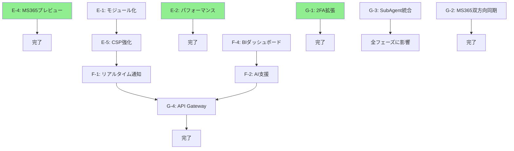

# Phase E/F/G 開発ロードマップ v2.0.0

**策定日**: 2026-02-07
**策定者**: roadmap-planner SubAgent (team-lead指示)
**プロジェクト**: Mirai Knowledge Systems
**現行バージョン**: v1.4.0 (Phase D完了)
**目標バージョン**: v2.0.0 (Phase G完了時)

---

## 📊 エグゼクティブサマリー

### 現状分析（Phase D完了時点）

**実装済み機能**:
- ✅ Phase D-3: 2要素認証（TOTP/MFA）
- ✅ Phase D-4: Microsoft 365連携基盤
- ✅ Phase D-5: PWA対応（オフライン・モバイル）
- ✅ Phase D-6: 往復開発ループ基盤

**技術的負債**:
- ❌ フロントエンドモジュール化（app.js 2,500行）
- ❌ N+1クエリ最適化（未検出・未対策）
- ❌ TODO残留: 7箇所（backend/app_v2.py、ms365_sync_service.py）
- ❌ innerHTML使用: 28箇所（11ファイル）

**未完了機能**:
- ⬜ Phase D-4.2: MS365ファイルプレビュー（Week 2-3未実装）
- ⬜ Phase D-3.1: 2FA拡張（SMS/WebAuthn）
- ⬜ Phase D-4.1: MS365リアルタイム通知
- ⬜ Phase D-4.3: MS365双方向同期
- ⬜ Phase D-5.1: PWA拡張（Push通知）
- ⬜ Phase D-6完全版: SubAgent 9体統合

### 開発戦略（3フェーズ構成）

| Phase | 目的 | 期間 | バージョン |
|-------|------|------|-----------|
| **Phase E** | **技術的負債返済+既存機能完成** | **2.5ヶ月** | **v1.5.0** |
| **Phase F** | **新規価値創造（BI・AI・通知）** | **3ヶ月** | **v1.6.0** |
| **Phase G** | **アーキテクチャ強化（API Gateway・SubAgent）** | **5ヶ月** | **v2.0.0** |
| Phase H（参考） | 長期展望（Kubernetes・SaaS化） | 6-12ヶ月 | v3.0.0 |

**合計期間**: Phase E-G で約10.5ヶ月

---

## 🎯 Phase E: 技術的負債返済+既存機能完成（v1.5.0）

### 概要

**期間**: 2.5ヶ月（10週間）
**目的**: 保守性向上・パフォーマンス改善・セキュリティ強化・既存機能完成
**優先度**: P0-P3（段階的実施）

### E-4: MS365ファイルプレビュー完成（P0 - 最優先）

**期間**: Week 1-2（4-5営業日）
**工数**: 28-40時間

#### 実装内容

**Week 2: フロントエンド実装（16-24h）**:
- `webui/file-preview.js`（推定400行）
  - プレビューモーダルUI
    - Office形式（.docx/.xlsx/.pptx）→ iframe埋め込み（Office Online）
    - PDF → pdfjs-dist統合
    - 画像（.jpg/.png）→ img要素表示
  - サムネイル画像表示
  - ダウンロード機能
  - エラーハンドリング（プレビュー不可時のフォールバック）

**Week 3: PWA統合・E2Eテスト（8-12h）**:
- Service Worker対応
  - プレビューURL/サムネイルキャッシュ（7日間）
  - オフライン時のキャッシュ表示
- Playwright E2Eテスト（5件）
  - プレビューモーダル表示
  - サムネイル読み込み
  - ダウンロード機能
  - オフライン動作
  - エラーケース

**Week 4: ドキュメント整備（4h）**:
- `docs/user-guide/MS365_SYNC_GUIDE.md`更新
- API仕様書更新

#### 成果物

- `webui/file-preview.js`（400行）
- `webui/sw.js`修正（+50行）
- Playwright E2Eテスト（5件、推定250行）
- ドキュメント更新

#### リスク

| リスク | 影響 | 対策 | 緊急度 |
|--------|------|------|--------|
| Office Online Embed API制限（未ログインアクセス不可） | 中 | ドキュメント明記、代替プレビュー（サムネイル）提供 | 低 |

---

### E-1: フロントエンドアーキテクチャ刷新（P1 - 高）

**期間**: Week 2-4（7-9営業日）
**工数**: 56-68時間

#### 実装内容

**1. ES6モジュール分割（24-32h）**:
- `app.js`（2,500行）→ 8モジュールに分割
  - `webui/core/router.js`: ルーティング
  - `webui/core/state-manager.js`: 状態管理
  - `webui/api/client.js`: API通信（fetch wrapper）
  - `webui/ui/components.js`: 再利用可能コンポーネント
  - `webui/ui/modal.js`: モーダルダイアログ
  - `webui/ui/table.js`: テーブル描画
  - `webui/ui/form.js`: フォーム処理
  - `webui/utils/validators.js`: バリデーション

**2. innerHTML完全排除（8-12h）**:
- 28箇所のinnerHTML → DOM API置換
  - `createElement` + `textContent`
  - `DocumentFragment`使用（パフォーマンス最適化）
  - XSS脆弱性完全排除

**3. TypeScript型定義導入（8h）**:
- JSDoc → TypeScript型定義ファイル（`*.d.ts`）
- IDE補完強化
- 型安全性向上

**4. テスト整備（16h）**:
- Jest単体テスト: 50件追加
- Playwright E2E: 10件追加

#### 成果物

- `webui/core/*.js`（8ファイル、推定3,000行）
- `webui/types/*.d.ts`（型定義、推定500行）
- テスト60件追加
- `docs/frontend/MODULE_ARCHITECTURE.md`（アーキテクチャ文書）

#### リスク

| リスク | 影響 | 対策 | 緊急度 |
|--------|------|------|--------|
| app.js大規模リファクタリングで既存機能破壊 | 高 | ①段階的移行（1モジュールずつ） ②E2E回帰テスト必須 ③feature flagによるロールバック準備 | 高 |

---

### E-2: バックエンドパフォーマンス最適化（P1 - 高）

**期間**: Week 3-5（7-8営業日）※Week 3から並列開始
**工数**: 56-64時間

#### 実装内容

**1. N+1クエリ検出（8h）**:
- SQLAlchemy lazy loading分析
- Flask-SQLAlchemy debug toolbar導入
- クエリ実行回数プロファイリング

**2. Eager Loading導入（16-24h）**:
- `joinedload()` / `selectinload()` 適用
- 主要エンドポイント最適化:
  - `GET /api/v1/knowledge`: ナレッジ一覧（想定N+1: カテゴリ・タグ）
  - `GET /api/v1/projects`: プロジェクト一覧（想定N+1: ナレッジ関連）
  - `GET /api/v1/experts`: 専門家一覧（想定N+1: スキル・所属）

**3. キャッシュ戦略導入（16h）**:
- Redis統合（Flask-Caching）
- キャッシュ対象:
  - カテゴリマスタ（TTL: 1h）
  - タグマスタ（TTL: 30min）
  - ユーザー権限（TTL: 5min）

**4. データベースインデックス最適化（8h）**:
- 検索クエリのINDEX追加
- EXPLAIN ANALYZE分析
- マイグレーションスクリプト作成

**5. パフォーマンステスト（8h）**:
- Locust負荷テスト（1,000 req/s目標）
- レスポンス時間計測
- Before/After比較レポート

#### 成果物

- `backend/cache_config.py`（キャッシュ設定、推定150行）
- `backend/migrations/versions/add_performance_indexes.py`（マイグレーション）
- Locust負荷テストスクリプト（推定200行）
- `docs/performance/OPTIMIZATION_REPORT.md`（最適化レポート）

#### リスク

| リスク | 影響 | 対策 | 緊急度 |
|--------|------|------|--------|
| Eager Loading導入でメモリ使用量増加 | 中 | ①selectinload優先（N+1回避） ②本番環境メモリ監視 | 中 |

---

### E-5: セキュリティ強化（P2 - 中）

**期間**: Week 6-8（5営業日）
**工数**: 40時間

#### 実装内容

**1. CSP（Content Security Policy）強化（8h）**:
- CSPヘッダー設定厳格化
  - `script-src 'self'`（inline script完全排除）
  - `style-src 'self'`（inline style完全排除）
  - `connect-src 'self' https://graph.microsoft.com`
- Nonce/Hash方式導入

**2. SAST（Static Application Security Testing）導入（8h）**:
- Bandit（Python）統合
- ESLint security plugin統合
- CI/CD自動実行

**3. 依存関係脆弱性スキャン（4h）**:
- Dependabot有効化
- Snyk統合（週次スキャン）
- 自動PR作成

**4. セキュリティ監査（16h）**:
- sec-auditor SubAgent起動
- OWASP ZAP動的スキャン
- 脆弱性診断レポート作成

**5. セキュリティヘッダー追加（4h）**:
- X-Content-Type-Options: nosniff
- X-Frame-Options: DENY
- Referrer-Policy: strict-origin-when-cross-origin
- Permissions-Policy設定

#### 成果物

- `backend/security_headers.py`（推定100行）
- `.github/workflows/security-scan.yml`（GitHub Actions）
- `docs/security/SECURITY_AUDIT_REPORT.md`（監査レポート）

#### 依存関係

- **前提**: E-1（inline script排除がCSP強化の前提）

#### リスク

| リスク | 影響 | 対策 | 緊急度 |
|--------|------|------|--------|
| CSP厳格化でサードパーティスクリプト動作不可 | 高 | ①Nonce方式導入 ②段階的ロールアウト（開発→ステージング→本番） | 高 |

---

### E-3: 技術的負債返済（P3 - 低）

**期間**: Week 8-10（4営業日）
**工数**: 28-32時間

#### 実装内容

**1. TODO残留削除（8-12h）**:
- `backend/app_v2.py`:
  - Line 1448: `roles` 取得実装（データベーステーブル作成）
  - Line 2357: メール送信実装（SendGrid統合）
  - Line 4404: お気に入り機能実装（users_favoritesテーブル）
  - Line 5136: Socket.IO接続数取得
- `backend/services/ms365_sync_service.py`:
  - Line 461: MetadataExtractor詳細抽出（Phase D-4完了時に実装済みの可能性）
  - Line 608: cron次回実行時刻計算（croniter導入）

**2. デッドコード削除（4h）**:
- 未使用関数・変数の削除
- flake8 unused-imports 警告解消

**3. Logging標準化（8h）**:
- structlog導入（構造化ログ）
- JSON形式ログ出力
- ELK Stack連携準備

**4. エラーハンドリング統一（8h）**:
- カスタム例外クラス導入
- エラーレスポンス形式統一
- RFC 7807（Problem Details）準拠

#### 成果物

- 7箇所のTODO実装完了
- `backend/logging_config.py`（ログ設定、推定100行）
- `backend/exceptions.py`（カスタム例外、推定200行）

---

### Phase E 完了時の目標KPI

#### コード品質

| 指標 | 現状 | 目標 | 改善率 |
|------|------|------|--------|
| フロントエンドモジュール数 | 1（app.js） | 8モジュール | - |
| innerHTML使用箇所 | 28箇所 | 0箇所 | **-100%** |
| TODO残留 | 7箇所 | 0箇所 | **-100%** |
| TypeScript型定義 | なし | 500行 | - |

#### パフォーマンス

| 指標 | 現状 | 目標 | 改善率 |
|------|------|------|--------|
| ナレッジ一覧レスポンス時間 | 未計測 | 200ms以下 | - |
| N+1クエリ数 | 未検出 | 0件 | **-100%** |
| Redisキャッシュヒット率 | - | 80%以上 | - |
| Locust負荷テスト（1,000 req/s） | - | 成功 | - |

#### セキュリティ

| 指標 | 現状 | 目標 | 改善率 |
|------|------|------|--------|
| CSP違反（inline script） | あり | なし | **-100%** |
| OWASP ZAP脆弱性 | 未検出 | 0件 | - |
| 依存関係脆弱性 | 未検出 | 0件（週次スキャン） | - |
| セキュリティヘッダースコア | 未計測 | A+（Mozilla Observatory） | - |

#### テスト

| 指標 | 現状 | 目標 | 改善率 |
|------|------|------|--------|
| フロントエンド単体テスト | 0件 | 50件 | - |
| E2Eテスト | 19件 | 34件 | **+79%** |
| テストカバレッジ | 91% | 93%以上 | +2% |

---

## 🚀 Phase F: 新規価値創造（v1.6.0）

### 概要

**期間**: 3ヶ月
**目的**: ビジネスインテリジェンス・リアルタイム通知・AI支援機能
**優先度**: P1-P2（ビジネス価値順）

### F-4: データ分析ダッシュボード（BI）（P0 - 最優先）

**期間**: Month 1（60-80時間）

#### 実装内容

**1. BI基盤構築（24h）**:
- Recharts/D3.js統合
- データ集計API（10エンドポイント）
  - ナレッジ活用状況（閲覧数・検索数・登録数）
  - 専門家稼働率（相談対応数・回答時間）
  - プロジェクト進捗（ナレッジ紐付け率・更新頻度）
- PostgreSQL集計クエリ最適化

**2. ダッシュボードUI（24h）**:
- 経営層向け概要ダッシュボード
  - KPI一覧（ナレッジ総数・専門家数・月間相談数）
  - トレンドグラフ（月次推移）
- 管理者向け詳細ダッシュボード
  - カテゴリ別活用状況
  - 専門家ランキング
  - 検索キーワード分析

**3. レポート生成機能（16h）**:
- PDF/Excel出力
- 定期レポート（週次・月次）
- メール配信（SendGrid統合）

**4. テスト・ドキュメント（12h）**:
- ユニットテスト: 20件
- E2Eテスト: 5件
- ユーザーガイド作成

#### 成果物

- `backend/analytics/`（集計API、推定800行）
- `webui/bi-dashboard.html`（ダッシュボードUI、推定600行）
- `webui/bi-dashboard.js`（ビジネスロジック、推定700行）
- テスト25件
- `docs/user-guide/BI_DASHBOARD_GUIDE.md`（400行）

#### ビジネス価値

- **経営層**: ROI可視化、意思決定支援
- **管理者**: ナレッジ品質管理、専門家配置最適化
- **ユーザー**: 人気ナレッジ発見、専門家ランキング

---

### F-1: リアルタイム通知（WebSocket/SSE）（P1 - 高）

**期間**: Month 2（60-80時間）

#### 実装内容

**1. WebSocket基盤（24h）**:
- Flask-SocketIO / FastAPI WebSocket統合
- 接続管理（認証・セッション管理）
- Room機能（プロジェクト別・専門家別）

**2. 通知機能（24h）**:
- ナレッジ更新通知
  - 新規登録、更新、削除
  - 関連プロジェクト通知
- MS365ファイル変更通知
  - SharePoint/OneDriveファイル同期完了
  - 同期エラー通知
- 専門家相談通知
  - 新規相談依頼
  - 回答完了

**3. フロントエンド統合（16h）**:
- 通知トースト表示
- 通知センター（履歴一覧）
- 未読バッジ表示

**4. PWA統合（8h）**:
- Service Worker通知
- バックグラウンド同期
- オフライン時のキューイング

**5. テスト・ドキュメント（12h）**:
- ユニットテスト: 15件
- E2Eテスト: 5件
- API仕様書更新

#### 成果物

- `backend/websocket/`（WebSocketサーバー、推定500行）
- `webui/notifications-realtime.js`（リアルタイム通知、推定400行）
- テスト20件
- `docs/api/WEBSOCKET_API.md`（300行）

#### 依存関係

- **前提**: E-5（WebSocket CSP設定）

---

### F-2: AI支援機能（GPT-4統合）（P1 - 高）

**期間**: Month 3（80-120時間）

#### 実装内容

**1. GPT-4統合基盤（24h）**:
- OpenAI API統合
- プロンプトエンジニアリング
- トークン管理・コスト最適化

**2. ナレッジ自動分類（24h）**:
- 新規ナレッジ登録時の自動カテゴリ提案
- タグ自動生成
- 類似ナレッジ検索

**3. 関連ナレッジ推薦（24h）**:
- ユーザー閲覧履歴分析
- コンテキストベース推薦
- プロジェクト関連ナレッジ提案

**4. 専門家マッチング（24h）**:
- 相談内容から専門家推薦
- スキル・経験・稼働率を考慮
- 最適な専門家ランキング表示

**5. フロントエンド統合（16h）**:
- AI推薦パネル
- 自動分類プレビュー
- 専門家マッチング結果表示

**6. テスト・ドキュメント（16h）**:
- ユニットテスト: 20件
- E2Eテスト: 5件
- ユーザーガイド作成

#### 成果物

- `backend/ai/`（AI統合、推定1,000行）
- `webui/ai-assistant.js`（AI支援UI、推定500行）
- テスト25件
- `docs/user-guide/AI_ASSISTANT_GUIDE.md`（400行）

#### 依存関係

- **前提**: F-4（BIダッシュボード → AI推薦結果表示）

---

### Phase F 完了時の目標KPI

#### ビジネス指標

| 指標 | 目標 |
|------|------|
| BI経営層利用率 | 80%以上 |
| リアルタイム通知開封率 | 60%以上 |
| AI推薦採用率 | 40%以上 |
| ナレッジ検索効率 | +30%改善（AI推薦による） |

#### 技術指標

| 指標 | 目標 |
|------|------|
| WebSocket同時接続数 | 500接続以上 |
| AI推論レスポンス時間 | 2秒以内 |
| BI集計クエリレスポンス時間 | 1秒以内 |

---

## 🏗️ Phase G: アーキテクチャ強化（v2.0.0）

### 概要

**期間**: 5ヶ月
**目的**: 2FA拡張・API Gateway・SubAgent統合・MS365双方向同期
**優先度**: P1-P2（技術的価値順）

### G-1: 2FA拡張（SMS/WebAuthn）（P1 - Quick Win）

**期間**: Month 1（24-32時間）

#### 実装内容

**1. SMS認証（16h）**:
- Twilio統合
- SMS送信・検証API
- フロントエンドSMS入力UI

**2. WebAuthn（16h）**:
- WebAuthn API統合（FIDO2）
- 生体認証（指紋・顔認証）対応
- セキュリティキー対応

**3. テスト・ドキュメント（8h）**:
- ユニットテスト: 10件
- E2Eテスト: 5件
- ユーザーガイド更新

#### 成果物

- `backend/auth/sms_manager.py`（SMS認証、推定200行）
- `backend/auth/webauthn_manager.py`（WebAuthn、推定300行）
- `webui/mfa-sms.js`（SMS UI、推定150行）
- `webui/mfa-webauthn.js`（WebAuthn UI、推定200行）
- テスト15件

---

### G-4: API Gateway導入（Kong/Tyk）（P1 - 高）

**期間**: Month 2（48-64時間）

#### 実装内容

**1. API Gateway構築（24h）**:
- Kong/Tyk選定・構築
- ルーティング設定
- プラグイン設定

**2. Rate Limiting（8h）**:
- エンドポイント別制限
- ユーザー別クォータ
- 動的レート調整

**3. OAuth2統合（16h）**:
- OAuth2プロバイダー設定
- トークン発行・検証
- スコープ管理

**4. 監視・ログ（8h）**:
- Prometheusメトリクス
- Grafanaダッシュボード
- アクセスログ集計

**5. テスト・ドキュメント（8h）**:
- 負荷テスト: Locust
- セキュリティテスト
- API Gateway運用ガイド

#### 成果物

- `config/kong.yml` / `config/tyk.json`（Gateway設定）
- `docs/operations/API_GATEWAY_GUIDE.md`（運用ガイド、推定400行）
- 負荷テストスクリプト

---

### G-3: SubAgent 9体統合（P0 - 最高価値）

**期間**: Month 3-4（160-200時間）

#### 実装内容

詳細は `docs/architecture/SUBAGENT_INTEGRATION_ARCHITECTURE.md` 参照。

**Phase 1: 基盤実装（Week 1-2、40h）**:
- SubAgent基底クラス
- FileAccessController
- SubAgentGuard
- AuditLogger
- Hooks実装（on-spec-complete, on-arch-approved）

**Phase 2: コアSubAgent実装（Week 3-5、80h）**:
- spec-planner実装
- arch-reviewer実装
- code-implementer実装
- code-reviewer実装（自動レビューゲート）
- test-designer実装
- test-reviewer実装
- ci-specialist実装

**Phase 3: 補助SubAgent実装（Week 6-7、40h）**:
- sec-auditor実装（CVEチェック、脆弱性スキャン）
- ops-runbook実装（Runbook生成）

**Phase 4: 並列実行・MCP統合（Week 8-9、40h）**:
- 複数独立タスクの並列実行
- 新機能実装の並列調査
- memory/memory-keeper初動確認パターン
- context7/github/brave-search統合

#### 成果物

- `backend/subagent/`（SubAgent基盤、推定2,000行）
- `.claude/hooks/`（Hooks実装、推定800行）
- `docs/subagent/USER_GUIDE.md`（ユーザーガイド、推定600行）
- E2Eテスト（全工程遷移）

#### リスク

| リスク | 影響 | 対策 | 緊急度 |
|--------|------|------|--------|
| SubAgent暴走・無限ループリスク | 高 | ①リトライ上限設定 ②差分量制限 ③同一エラー2回で停止 | 高 |

---

### G-2: MS365双方向同期（P2 - 中）

**期間**: Month 5（80-120時間）

#### 実装内容

**1. 双方向同期基盤（32h）**:
- MKS → MS365同期
  - ナレッジDB更新 → SharePointファイル更新
  - トランザクション管理
- MS365 → MKS同期
  - 既存の単方向同期の拡張

**2. 競合解決（24h）**:
- 競合検出（Last-Modified比較）
- 競合解決戦略
  - Server Wins（サーバー優先）
  - Client Wins（クライアント優先）
  - Manual Merge（手動マージ）

**3. トランザクション管理（24h）**:
- 2フェーズコミット
- ロールバック処理
- 整合性チェック

**4. 監視・テスト（16h）**:
- 同期状態監視
- 競合検出アラート
- E2Eテスト（競合シナリオ）

#### 成果物

- `backend/services/ms365_bidirectional_sync.py`（双方向同期、推定800行）
- `backend/services/conflict_resolver.py`（競合解決、推定400行）
- テスト20件
- `docs/user-guide/MS365_BIDIRECTIONAL_SYNC_GUIDE.md`（600行）

---

### Phase G 完了時の目標KPI

#### 認証指標

| 指標 | 目標 |
|------|------|
| 2FA有効化率 | 80%以上 |
| SMS/WebAuthn利用率 | 30%以上（TOTP 70%） |

#### API Gateway指標

| 指標 | 目標 |
|------|------|
| API Gateway経由率 | 100% |
| Rate Limiting誤検知率 | 1%以下 |
| OAuth2認証成功率 | 99%以上 |

#### SubAgent指標

| 指標 | 目標 |
|------|------|
| 自動レビューゲート通過率 | 80%以上（1回目PASS） |
| SubAgent暴走検出数 | 0件 |
| 工程遷移自動化率 | 90%以上 |

#### MS365同期指標

| 指標 | 目標 |
|------|------|
| 双方向同期成功率 | 95%以上 |
| 競合発生率 | 5%以下 |
| 競合自動解決率 | 80%以上 |

---

## 📊 優先度マトリクス

### ビジネス価値 × 実現容易性（2軸評価）

#### Phase E

| Phase | ビジネス価値 | 実現容易性 | 総合優先度 | 評価 |
|-------|-------------|-----------|-----------|------|
| **E-4** | ★★★★★ (5) | ★★★★★ (5) | **P0（最優先）** | ★★★★★ |
| **E-2** | ★★★★★ (5) | ★★★☆☆ (3) | **P1（高）** | ★★★★☆ |
| **E-1** | ★★★☆☆ (3) | ★★☆☆☆ (2) | **P1（高）** | ★★★☆☆ |
| **E-5** | ★★★★☆ (4) | ★★★☆☆ (3) | **P2（中）** | ★★★★☆ |
| **E-3** | ★★☆☆☆ (2) | ★★★★☆ (4) | **P3（低）** | ★★☆☆☆ |

#### Phase F

| Phase | ビジネス価値 | 実現容易性 | 総合優先度 | 評価 |
|-------|-------------|-----------|-----------|------|
| **F-4** | ★★★★★ (5) | ★★★★☆ (4) | **P0（最優先）** | ★★★★★ |
| **F-1** | ★★★★☆ (4) | ★★★☆☆ (3) | **P1（高）** | ★★★★☆ |
| **F-2** | ★★★★☆ (4) | ★★★☆☆ (3) | **P1（高）** | ★★★★☆ |
| **F-3** | ★★☆☆☆ (2) | ★★☆☆☆ (2) | **P3（低）** | ★★☆☆☆ |

#### Phase G

| Phase | ビジネス価値 | 実現容易性 | 総合優先度 | 評価 |
|-------|-------------|-----------|-----------|------|
| **G-3** | ★★★★★ (5) | ★☆☆☆☆ (1) | **P0（最高価値）** | ★★★★★ |
| **G-4** | ★★★★☆ (4) | ★★★★☆ (4) | **P1（高）** | ★★★★☆ |
| **G-1** | ★★★☆☆ (3) | ★★★★★ (5) | **P1（Quick Win）** | ★★★☆☆ |
| **G-2** | ★★★☆☆ (3) | ★★☆☆☆ (2) | **P2（中）** | ★★★☆☆ |

---

## 🎯 Quick Wins（短期で効果が高い施策 TOP 5）

| 順位 | Phase | 施策 | 期間 | 効果 | 評価 |
|------|-------|------|------|------|------|
| **1** | **E-4** | **MS365ファイルプレビュー完成** | **4-5日** | **ユーザー体験向上** | **★★★★★** |
| **2** | **E-2部分** | **N+1検出+主要3エンドポイント最適化** | **5日** | **パフォーマンス体感向上** | **★★★★☆** |
| **3** | **F-4部分** | **基本BIダッシュボード（KPI一覧）** | **7日** | **経営層可視化** | **★★★★★** |
| **4** | **E-3** | **TODO削除（7箇所）** | **4日** | **コード品質向上** | **★★★☆☆** |
| **5** | **G-1** | **2FA SMS拡張** | **3日** | **セキュリティ選択肢増** | **★★★☆☆** |

---

## 🗓️ マイルストーン定義

### Phase E マイルストーン（Week単位）

| Week | Phase | マイルストーン | 成果物 |
|------|-------|---------------|--------|
| **Week 1** | **E-4** | MS365プレビュー Week 1完了 | file-preview.js |
| **Week 2** | **E-4** | MS365プレビュー完成 | PWA統合、E2Eテスト |
| **Week 2-4** | **E-1** | フロントエンドモジュール化 | 8モジュール、型定義 |
| **Week 3-5** | **E-2** | パフォーマンス最適化 | N+1排除、Redis統合 |
| **Week 6-8** | **E-5** | セキュリティ強化 | CSP、SAST、ZAP監査 |
| **Week 8-10** | **E-3** | 技術的負債返済 | TODO削除、structlog |

### Phase F マイルストーン（Month単位）

| Month | Phase | マイルストーン | 成果物 |
|-------|-------|---------------|--------|
| **Month 1** | **F-4** | BIダッシュボード完成 | Recharts UI、集計API |
| **Month 2** | **F-1** | リアルタイム通知完成 | WebSocket、通知センター |
| **Month 3** | **F-2** | AI支援機能完成 | GPT-4統合、推薦エンジン |

### Phase G マイルストーン（Month単位）

| Month | Phase | マイルストーン | 成果物 |
|-------|-------|---------------|--------|
| **Month 1** | **G-1** | 2FA拡張完成 | SMS/WebAuthn |
| **Month 2** | **G-4** | API Gateway完成 | Kong/Tyk、Rate Limiting |
| **Month 3-4** | **G-3** | SubAgent統合完成 | 9体SubAgent、Hooks |
| **Month 5** | **G-2** | MS365双方向同期完成 | 競合解決、トランザクション |

---

## 🛡️ リスク評価表

### 高リスク項目

| Phase | リスク | 影響度 | 発生確率 | 対策 | 緊急度 |
|-------|--------|--------|---------|------|--------|
| **E-1** | app.js大規模リファクタリングで既存機能破壊 | ★★★★★ | ★★★★☆ | ①段階的移行（1モジュールずつ） ②E2E回帰テスト必須 ③feature flagによるロールバック準備 | 高 |
| **E-5** | CSP厳格化でサードパーティスクリプト動作不可 | ★★★★☆ | ★★★☆☆ | ①Nonce方式導入 ②段階的ロールアウト（開発→ステージング→本番） | 高 |
| **G-3** | SubAgent暴走・無限ループリスク | ★★★★★ | ★★★☆☆ | ①リトライ上限設定 ②差分量制限 ③同一エラー2回で停止 | 高 |

### 中リスク項目

| Phase | リスク | 影響度 | 発生確率 | 対策 | 緊急度 |
|-------|--------|--------|---------|------|--------|
| **E-2** | Eager Loading導入でメモリ使用量増加 | ★★★☆☆ | ★★★☆☆ | ①selectinload優先（N+1回避） ②本番環境メモリ監視 | 中 |
| **E-4** | Office Online Embed API制限（未ログインアクセス不可） | ★★★☆☆ | ★★☆☆☆ | ①ドキュメント明記 ②代替プレビュー（サムネイル）提供 | 低 |
| **G-2** | MS365双方向同期の競合処理複雑化 | ★★★★☆ | ★★★☆☆ | ①競合検出アラート ②手動マージUI提供 | 中 |

### 低リスク項目

| Phase | リスク | 影響度 | 発生確率 | 対策 | 緊急度 |
|-------|--------|--------|---------|------|--------|
| **E-3** | メール送信実装（SendGrid）でコスト増加 | ★★☆☆☆ | ★★☆☆☆ | ①無料枠確認 ②送信数制限実装 | 低 |
| **F-2** | AI推論コスト増加（GPT-4 API） | ★★★☆☆ | ★★☆☆☆ | ①キャッシュ戦略 ②トークン最適化 | 低 |

---

## 📈 リソース見積もり

### Phase E（技術的負債返済）

| Phase | 工数 | 期間（並列実施） | 依存ライブラリ |
|-------|------|------------------|---------------|
| E-4 | 28-40h | 4-5日 | pdfjs-dist |
| E-1 | 56-68h | 7-9日 | TypeScript, Jest |
| E-2 | 56-64h | 7-8日 | Redis, Flask-Caching, Locust |
| E-5 | 40h | 5日 | Bandit, ESLint, OWASP ZAP, Snyk |
| E-3 | 28-32h | 4日 | structlog, SendGrid, croniter |
| **合計** | **208-244h** | **約10週間（並列実施で短縮）** | - |

### Phase F（新規価値創造）

| Phase | 工数 | 期間 | 依存ライブラリ |
|-------|------|------|---------------|
| F-4 | 60-80h | 1ヶ月 | Recharts/D3.js, SendGrid |
| F-1 | 60-80h | 1ヶ月 | Flask-SocketIO/FastAPI WebSocket |
| F-2 | 80-120h | 1ヶ月 | OpenAI GPT-4 API |
| **合計** | **200-280h** | **約3ヶ月** | - |

### Phase G（アーキテクチャ強化）

| Phase | 工数 | 期間 | 依存ライブラリ |
|-------|------|------|---------------|
| G-1 | 24-32h | 2週間 | Twilio, Auth0 WebAuthn |
| G-4 | 48-64h | 1ヶ月 | Kong/Tyk API Gateway |
| G-3 | 160-200h | 2ヶ月 | なし（自社開発） |
| G-2 | 80-120h | 1ヶ月 | なし（既存MS365連携拡張） |
| **合計** | **312-416h** | **約5ヶ月** | - |

### Phase H（長期展望、参考）

| Phase | 工数 | 期間 | 依存ライブラリ |
|-------|------|------|---------------|
| H-1 | 120h | 2ヶ月 | Kubernetes, Helm, Docker |
| H-2 | 200h | 3ヶ月 | PostgreSQL Row-Level Security |
| **合計** | **320h** | **5ヶ月** | - |

---

## 🔄 技術的依存関係グラフ

**Critical Path**: E-1 → E-5 → F-1 → G-4 → Phase G完了

**Parallel Path**: E-2, E-4, F-4, G-1 （独立実施可能）

---

## 📚 Phase H: 長期展望（v3.0.0、参考）

### H-1: Kubernetes移行（コンテナオーケストレーション）

**期間**: 2ヶ月（120時間）

#### 実装内容

- Docker Compose → Kubernetes移行
- Helm Chart作成
- 自動スケーリング（HPA/VPA）
- ローリングアップデート
- カナリアデプロイ

#### 成果物

- `k8s/*.yaml`（Kubernetes manifest）
- `helm/mks/`（Helm Chart）
- CI/CD統合（GitHub Actions → ArgoCD）

---

### H-2: マルチテナント対応（複数企業向けSaaS化）

**期間**: 3ヶ月（200時間）

#### 実装内容

- テナント分離（PostgreSQL Row-Level Security）
- サブドメイン分離（tenant1.mks.example.com）
- テナント管理画面
- 契約・課金管理（Stripe統合）
- データエクスポート機能

#### 成果物

- `backend/tenancy/`（テナント管理、推定1,500行）
- テナント管理画面（推定800行）
- 契約管理API（推定600行）

---

## ✅ Phase E/F/G 完了定義（Definition of Done）

### Phase E 完了条件

#### 技術的完了条件

- [ ] E-4: ファイルプレビュー機能完全動作、E2Eテスト 5/5件成功
- [ ] E-1: フロントエンド8モジュール分割完了、innerHTML 0件
- [ ] E-2: N+1クエリ 0件、キャッシュヒット率80%以上
- [ ] E-5: OWASP ZAP脆弱性 0件、CSP違反 0件
- [ ] E-3: TODO残留 0件、structlog導入完了

#### ドキュメント完了条件

- [ ] 各フェーズの完了レポート作成（Markdown形式）
- [ ] APIドキュメント更新（OpenAPI 3.0）
- [ ] ユーザーガイド更新

#### テスト完了条件

- [ ] ユニットテスト: +50件（フロントエンド）
- [ ] E2Eテスト: +15件（Playwright）
- [ ] 負荷テスト: 1,000 req/s成功（Locust）
- [ ] セキュリティスキャン: 脆弱性 0件（OWASP ZAP）
- [ ] テストカバレッジ: 93%以上

### Phase F 完了条件

#### 技術的完了条件

- [ ] F-4: BIダッシュボード稼働、経営層利用率80%以上
- [ ] F-1: リアルタイム通知稼働、通知開封率60%以上
- [ ] F-2: AI支援機能稼働、推薦採用率40%以上

#### ビジネス完了条件

- [ ] BI経営層トレーニング完了
- [ ] リアルタイム通知ユーザーフィードバック良好
- [ ] AI推薦精度80%以上

### Phase G 完了条件

#### 技術的完了条件

- [ ] G-1: 2FA有効化率80%以上
- [ ] G-4: API Gateway経由率100%
- [ ] G-3: 自動レビューゲート通過率80%以上（1回目PASS）
- [ ] G-2: 双方向同期成功率95%以上

#### 運用完了条件

- [ ] API Gateway運用ガイド整備
- [ ] SubAgent運用ガイド整備
- [ ] MS365双方向同期運用ガイド整備

---

## 🎓 次のアクション

### 即時着手（Week 1）

1. **E-4完成**: MS365ファイルプレビュー（file-preview.js実装）
2. **E-2開始**: N+1クエリ検出（SQLAlchemy debug toolbar導入）
3. **G-1開始**: 2FA SMS拡張（Twilio統合検討）

### Week 2以降

4. **E-1開始**: フロントエンドモジュール化（仕様書作成 by spec-planner）
5. **F-4計画**: BIダッシュボード仕様策定

### SubAgent連携

- **spec-planner**: E-1仕様書策定
- **code-implementer**: E-4 file-preview.js実装
- **test-designer**: E-4 E2Eテスト設計
- **arch-reviewer**: E-2 N+1クエリ検出（Explore agent）

---

## 📖 参考資料

### 既存ドキュメント

- [CLAUDE.md](../.claude/CLAUDE.md): プロジェクト概要
- [PHASE_E_ROADMAP.md](./PHASE_E_ROADMAP.md): Phase E既存ロードマップ（v1.0.0）
- [SUBAGENT_INTEGRATION_ARCHITECTURE.md](../docs/architecture/SUBAGENT_INTEGRATION_ARCHITECTURE.md): SubAgent統合設計書
- [PHASE_D5_PWA_COMPLETION_REPORT.md](../docs/PHASE_D5_PWA_COMPLETION_REPORT.md): PWA実装完了レポート
- [MS365_SYNC_COMPLETION_SUMMARY.md](../docs/MS365_SYNC_COMPLETION_SUMMARY.md): MS365完了サマリー

### 外部技術資料

- [Frontend Module Architecture Best Practices](https://developer.mozilla.org/en-US/docs/Web/JavaScript/Guide/Modules)
- [SQLAlchemy Eager Loading](https://docs.sqlalchemy.org/en/20/orm/loading_relationships.html)
- [OWASP Content Security Policy Cheat Sheet](https://cheatsheetseries.owasp.org/cheatsheets/Content_Security_Policy_Cheat_Sheet.html)
- [Flask-SocketIO Documentation](https://flask-socketio.readthedocs.io/)
- [OpenAI GPT-4 API Documentation](https://platform.openai.com/docs/guides/gpt)
- [Kong API Gateway](https://docs.konghq.com/)
- [WebAuthn Guide](https://webauthn.guide/)

---

**策定完了**: 2026-02-07
**承認**: 未承認（team-leadレビュー待ち）
**次回更新**: Phase E-4完了時（Week 2）
